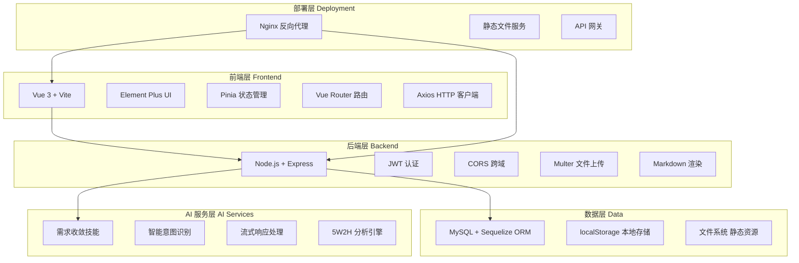
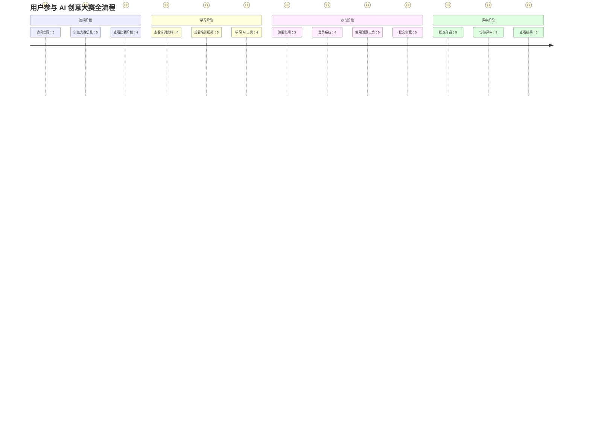
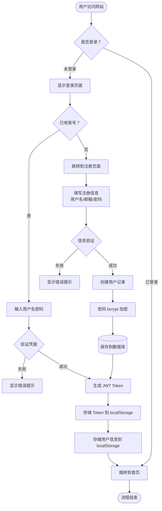
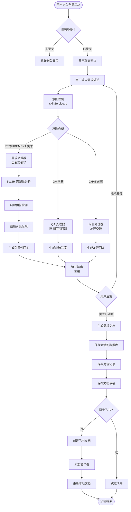
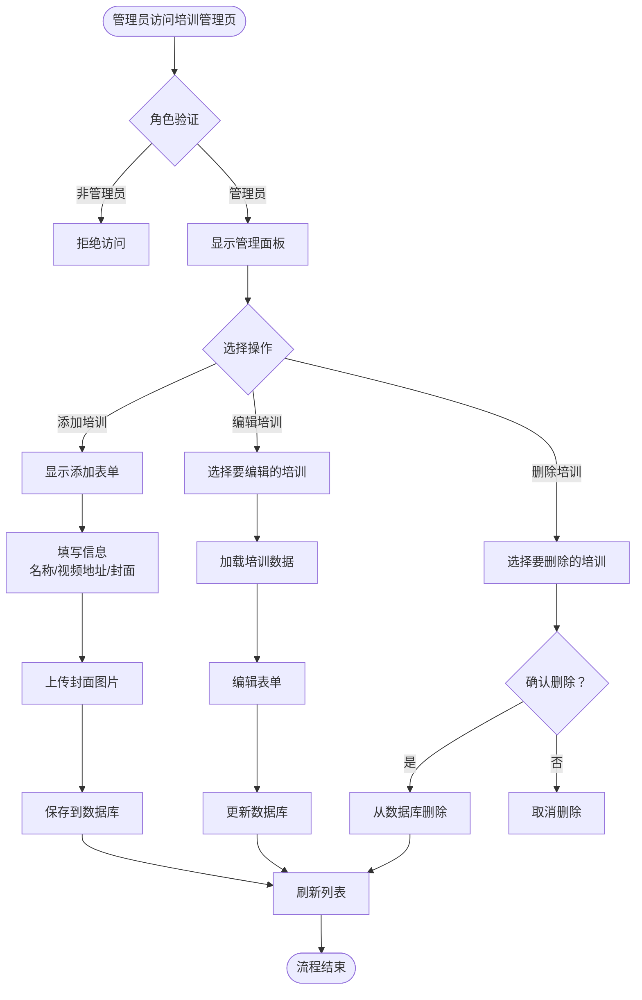
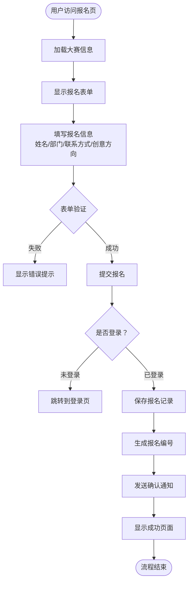
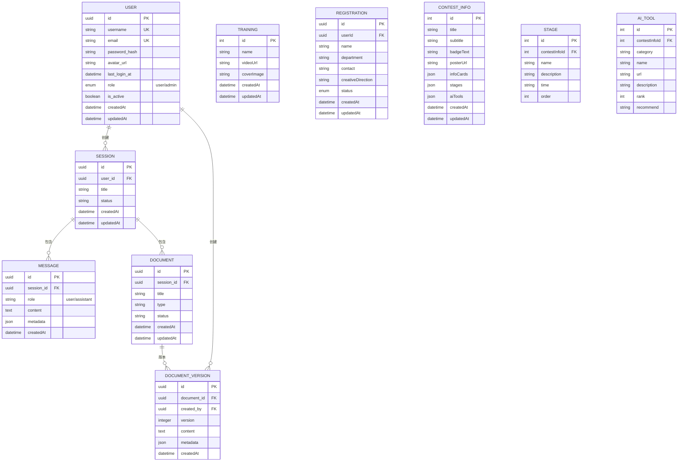
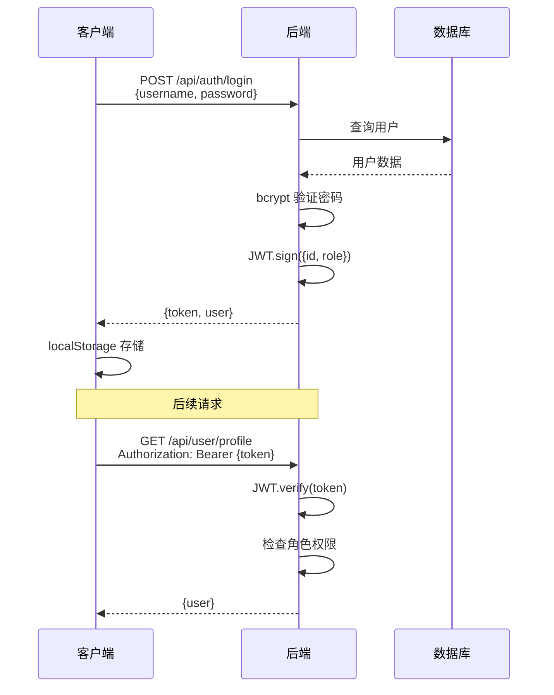

# AI 创意大赛网站系统 - 架构与业务流程概览

> 文档版本：1.0.0  
> 生成时间：2026-03-18  
> 系统版本：v2.0.0

---

## 一、系统总体架构

### 1.1 技术栈架构



### 1.2 系统分层架构图

```
┌─────────────────────────────────────────────────────────────┐
│                      客户端层 Client                          │
│  ┌──────────────────────────────────────────────────────┐   │
│  │  Vue 3 单页应用 (SPA)                                 │   │
│  │  - 组件系统：Header, Footer, Modal 等                │   │
│  │  - 页面视图：Home, Training, Registration 等         │   │
│  │  - 路由守卫：角色权限控制                            │   │
│  │  - 状态管理：Pinia Store (user, token)              │   │
│  └──────────────────────────────────────────────────────┘   │
└─────────────────────────────────────────────────────────────┘
                            ↓ HTTP/HTTPS
┌─────────────────────────────────────────────────────────────┐
│                      网关层 Gateway                           │
│  ┌──────────────────────────────────────────────────────┐   │
│  │  Nginx                                                │   │
│  │  - 反向代理：/ai-contest/api → backend:3000          │   │
│  │  - 静态资源：/ai-contest → frontend/dist             │   │
│  │  - 文件上传：/ai-contest/uploads                     │   │
│  │  - 负载均衡 (未来扩展)                                │   │
│  └──────────────────────────────────────────────────────┘   │
└─────────────────────────────────────────────────────────────┘
                            ↓
┌─────────────────────────────────────────────────────────────┐
│                      应用层 Application                       │
│  ┌──────────────────────────────────────────────────────┐   │
│  │  Express.js 服务器                                    │   │
│  │  ┌────────────────────────────────────────────────┐  │   │
│  │  │ 中间件层 Middleware                             │  │   │
│  │  │ - CORS 跨域处理                                 │  │   │
│  │  │ - JWT 认证 (auth.js)                            │  │   │
│  │  │ - 请求解析 (JSON, URL-encoded)                 │  │   │
│  │  │ - 文件上传 (Multer)                             │  │   │
│  │  └────────────────────────────────────────────────┘  │   │
│  │  ┌────────────────────────────────────────────────┐  │   │
│  │  │ 路由层 Routes                                   │  │   │
│  │  │ - /api/auth        认证路由                     │  │   │
│  │  │ - /api/user        用户路由                     │  │   │
│  │  │ - /api/trainings   培训路由                     │  │   │
│  │  │ - /api/contest     大赛信息路由                 │  │   │
│  │  │ - /api/sessions    会话路由                     │  │   │
│  │  │ - /api/requirement 需求收敛路由                 │  │   │
│  │  │ - /api/admin       管理员路由                   │  │   │
│  │  └────────────────────────────────────────────────┘  │   │
│  │  ┌────────────────────────────────────────────────┐  │   │
│  │  │ 服务层 Services                                 │  │   │
│  │  │ - skillService.js     技能服务                  │  │   │
│  │  │ - intentRecognizer.js 意图识别                  │  │   │
│  │  │ - requirement-convergence/ 需求收敛引擎         │  │   │
│  │  │   ├─ insight-engine/      智能洞察              │  │   │
│  │  │   ├─ knowledge-graph/   知识图谱                │  │   │
│  │  │   ├─ validation-engine/ 验证引擎                │  │   │
│  │  │   ├─ template-library/  模板库                  │  │   │
│  │  │   └─ persona-engine/    人格化引擎              │  │   │
│  │  └────────────────────────────────────────────────┘  │   │
│  └──────────────────────────────────────────────────────┘   │
└─────────────────────────────────────────────────────────────┘
                            ↓
┌─────────────────────────────────────────────────────────────┐
│                      数据层 Data                              │
│  ┌──────────────────────────────────────────────────────┐   │
│  │  MySQL 数据库 (Sequelize ORM)                         │   │
│  │  核心表：                                              │   │
│  │  - users            用户表                           │   │
│  │  - trainings        培训资料表                       │   │
│  │  - registrations    报名表                           │   │
│  │  - contest_info     大赛信息表                       │   │
│  │  - stages           比赛阶段表                       │   │
│  │  - ai_tools         AI 工具表                         │   │
│  │  - sessions         会话表                           │   │
│  │  - messages         消息表                           │   │
│  │  - documents        文档表                           │   │
│  │  - document_versions 文档版本表                      │   │
│  └──────────────────────────────────────────────────────┘   │
│  ┌──────────────────────────────────────────────────────┐   │
│  │  文件系统 File System                                 │   │
│  │  - /uploads/          上传文件                       │   │
│  │  - /poster.jpg        静态资源                       │   │
│  └──────────────────────────────────────────────────────┘   │
└─────────────────────────────────────────────────────────────┘
```

---

## 二、核心业务流程

### 2.1 用户旅程地图 (User Journey Map)



### 2.2 核心业务流程图

#### 流程 1：用户注册与登录流程



**详细步骤说明：**

| 步骤 | 组件 | 技术实现 | 说明 |
|------|------|----------|------|
| 1. 填写信息 | Frontend | Vue Form + Element Plus | 表单验证在前端完成 |
| 2. 提交请求 | Frontend | Axios POST /api/auth/register | 携带用户名/邮箱/密码 |
| 3. 后端验证 | Backend | Express Validator | 检查邮箱唯一性、密码强度 |
| 4. 密码加密 | Backend | bcryptjs | 10 轮 salt 加密 |
| 5. 保存数据库 | Backend | Sequelize User.create() | 写入 users 表 |
| 6. 生成 Token | Backend | jsonwebtoken.sign() | JWT 包含 userId 和 role |
| 7. 返回前端 | Backend | Response JSON | {code: 0, data: {user, token}} |
| 8. 本地存储 | Frontend | localStorage | 存储 token 和 userInfo |
| 9. 路由跳转 | Frontend | Vue Router.push() | 跳转到首页或目标页面 |

#### 流程 2：创意工坊需求澄清流程



**需求收敛技能核心能力：**

| 能力模块 | 文件路径 | 功能描述 |
|----------|----------|----------|
| 意图识别 | `intentRecognizer.js` | 识别 QA/REQUIREMENT/CHAT 三种意图 |
| 5W2H 分析 | `skillService.js` | Who/What/Why/When/Where/How/HowMuch 七维度评分 |
| 风险预警 | `skillService.js` | 检测模糊表述、潜在冲突 |
| 依赖发现 | `skillService.js` | 识别外部系统、数据源、前置条件 |
| 智能推荐 | `insight-engine.ts` | 基于历史需求库推荐最佳实践 |
| 知识图谱 | `knowledge-graph/` | 构建需求关系图谱、影响分析 |
| 需求验证 | `validation-engine/` | 可测试性检查、验收标准生成 |
| 行业模板 | `template-library/` | 提供法务/金融/电商等行业模板 |
| 人格化交互 | `persona-engine/` | 分析师/引导者/质疑者角色切换 |

#### 流程 3：培训资料管理流程



**数据模型：**

```javascript
// Training 模型 (server/models/Training.js)
{
  id: { type: INTEGER, primaryKey: true, autoIncrement: true },
  name: { type: STRING(100), allowNull: false },
  videoUrl: { type: STRING, allowNull: false },
  coverImage: { type: STRING }, // URL 或 Base64
  createdAt: { type: DATE },
  updatedAt: { type: DATE }
}
```

#### 流程 4：大赛报名流程



**数据模型：**

```javascript
// Registration 模型
{
  id: { type: UUID, primaryKey: true },
  userId: { type: UUID, foreignKey: true },
  name: { type: STRING(50), allowNull: false },
  department: { type: STRING(100) },
  contact: { type: STRING(50) },
  creativeDirection: { type: TEXT },
  status: { type: ENUM('pending', 'approved', 'rejected'), defaultValue: 'pending' },
  createdAt: { type: DATE },
  updatedAt: { type: DATE }
}
```

---

## 三、数据架构

### 3.1 数据库 ER 图



### 3.2 数据表统计

| 表名 | 说明 | 主要字段 | 数据量级 |
|------|------|----------|----------|
| users | 用户表 | id, username, email, role | 预计 100-500 |
| sessions | 会话表 | id, user_id, title, status | 预计 1000+ |
| messages | 消息表 | id, session_id, role, content | 预计 10000+ |
| documents | 文档表 | id, session_id, title, type | 预计 500+ |
| document_versions | 文档版本表 | id, document_id, version, content | 预计 2000+ |
| trainings | 培训表 | id, name, videoUrl, coverImage | < 50 |
| registrations | 报名表 | id, userId, name, status | 预计 100-300 |
| contest_info | 大赛信息表 | id, title, subtitle, config | 1 (单条配置) |
| stages | 比赛阶段表 | id, contestInfoId, name, order | 5 (5 个阶段) |
| ai_tools | AI 工具表 | id, contestInfoId, category, url | 20-30 |

---

## 四、API 接口架构

### 4.1 API 路由树

```
/api
├── /auth
│   ├── POST   /login          用户登录
│   ├── POST   /register       用户注册
│   └── POST   /logout         用户登出
│
├── /user
│   ├── GET    /profile        获取用户信息
│   ├── PUT    /profile        更新用户信息
│   └── PUT    /password       修改密码
│
├── /trainings
│   ├── GET    /               获取培训列表
│   ├── POST   /               创建培训 (需管理员)
│   ├── GET    /:id            获取培训详情
│   ├── PUT    /:id            更新培训 (需管理员)
│   └── DELETE /:id            删除培训 (需管理员)
│
├── /contest
│   ├── GET    /info           获取大赛信息
│   └── PUT    /info           更新大赛信息 (需管理员)
│
├── /registrations
│   ├── GET    /               获取报名列表 (需管理员)
│   ├── POST   /               创建报名
│   ├── GET    /:id            获取报名详情
│   └── PUT    /:id/status     更新报名状态 (需管理员)
│
├── /sessions
│   ├── GET    /               获取会话列表
│   ├── POST   /               创建会话
│   ├── GET    /:id            获取会话详情
│   └── DELETE /:id            删除会话
│
├── /requirement
│   ├── POST   /analyze        需求分析
│   ├── POST   /validate       需求验证
│   ├── POST   /graph          需求图谱
│   ├── POST   /recommend      智能推荐
│   └── GET    /health         健康检查
│
├── /admin
│   ├── GET    /users          获取用户列表
│   ├── GET    /logs           获取系统日志
│   └── GET    /stats          获取统计数据
│
└── /upload
    └── POST   /               文件上传
```

### 4.2 核心 API 接口详解

#### 4.2.1 认证接口

**POST /api/auth/login**

```javascript
// 请求
{
  "username": "admin",
  "password": "admin123"
}

// 响应 (成功)
{
  "code": 0,
  "data": {
    "user": {
      "id": "uuid",
      "username": "admin",
      "email": "admin@ai-contest.com",
      "role": "admin"
    },
    "token": "eyJhbGciOiJIUzI1NiIsInR5cCI6IkpXVCJ9..."
  }
}

// 响应 (失败)
{
  "code": 401,
  "message": "用户名或密码错误"
}
```

**POST /api/auth/register**

```javascript
// 请求
{
  "username": "zhangsan",
  "email": "zhangsan@haier.com",
  "password": "securePassword123"
}

// 响应
{
  "code": 0,
  "data": {
    "user": { ... },
    "token": "..."
  }
}
```

#### 4.2.2 需求分析接口

**POST /api/requirement/analyze**

```javascript
// 请求
{
  "requirement": "需要一个合同审查系统，支持自动识别合同类型和风险条款"
}

// 响应
{
  "success": true,
  "data": {
    "completeness": {
      "score": {
        "totalScore": 65,
        "who": 80,
        "what": 90,
        "why": 40,
        "when": 20,
        "where": 60,
        "how": 70,
        "howMuch": 30
      },
      "missingElements": [
        "Why 维度需要补充",
        "When 维度需要补充",
        "HowMuch 维度需要补充"
      ]
    },
    "risks": {
      "risks": [
        {
          "type": "vague",
          "level": "medium",
          "description": "发现模糊表述：\"自动\"",
          "suggestion": "请明确自动化的具体范围"
        }
      ],
      "overallRiskLevel": "medium"
    },
    "dependencies": {
      "dependencies": [
        {
          "type": "external_system",
          "name": "依赖接口",
          "description": "可能需要 NLP 服务接口",
          "isRequired": true
        }
      ],
      "total": 1
    },
    "recommendations": {
      "recommendations": [],
      "bestPractices": [],
      "relatedTemplates": []
    }
  },
  "timestamp": "2026-03-18T10:30:00.000Z"
}
```

---

## 五、前端架构

### 5.1 组件树结构

```
App.vue
├── Header.vue (全局导航)
│   ├── Logo
│   ├── Menu Items (首页/培训/创意工坊)
│   └── User Menu (登录/注册/个人中心)
│
├── Router View (路由页面)
│   ├── Home.vue (首页)
│   │   ├── Hero Section (大赛标题)
│   │   ├── Poster Section (海报展示)
│   │   ├── Timeline Section (比赛阶段)
│   │   └── Tools Section (AI 工具)
│   │
│   ├── Training.vue (培训页)
│   │   ├── Training List (培训卡片)
│   │   └── Admin Panel (管理员面板)
│   │       ├── Add Training Modal
│   │       └── Edit Training Modal
│   │
│   ├── Registration.vue (报名页)
│   │   └── Registration Form
│   │
│   ├── requirement/Layout.vue (创意工坊布局)
│   │   ├── SessionList.vue (会话列表)
│   │   ├── ChatWindow.vue (聊天窗口)
│   │   └── DocumentList.vue (文档管理)
│   │
│   └── user/Login.vue (登录页)
│       └── Login Form
│
└── Footer.vue (全局页脚)
```

### 5.2 状态管理 (Pinia)

**user store**

```javascript
// src/stores/user.js
{
  token: string,           // JWT Token
  userInfo: {              // 用户信息
    id: string,
    username: string,
    email: string,
    role: 'user' | 'admin'
  },
  isLoggedIn: boolean,     // 是否登录
  getUserRole: string,     // 用户角色
  
  // Actions
  login(username, password) → Promise
  register(username, email, password) → Promise
  logout() → Promise
  fetchProfile() → Promise
  setToken(token) → void
  setUserInfo(info) → void
}
```

### 5.3 路由配置

```javascript
// src/router/index.js
[
  { path: '/', name: 'Home', component: Home },
  { path: '/training', name: 'Training', component: Training },
  { path: '/registration', name: 'Registration', component: Registration },
  { 
    path: '/requirement',
    name: 'Requirement',
    component: Layout,
    meta: { requiresAuth: true, requiresRole: ['user', 'admin'] },
    children: [
      { path: '', redirect: '/requirement/sessions' },
      { path: 'sessions', name: 'SessionList', component: SessionList },
      { path: 'session/:id', name: 'ChatWindow', component: ChatWindow },
      { path: 'documents', name: 'DocumentList', component: DocumentList }
    ]
  },
  { path: '/user/login', name: 'UserLogin', component: UserLogin },
  { path: '/user/register', name: 'UserRegister', component: UserRegister },
  { path: '/training-admin', name: 'TrainingAdmin', component: TrainingAdmin, meta: { requiresAuth: true, requiresRole: 'admin' } }
]
```

---

## 六、安全架构

### 6.1 认证与授权

**JWT Token 流程：**



**权限控制矩阵：**

| 资源/操作 | 匿名 | 普通用户 | 管理员 |
|-----------|------|----------|--------|
| 访问首页 | ✅ | ✅ | ✅ |
| 查看培训 | ❌ | ✅ | ✅ |
| 管理培训 | ❌ | ❌ | ✅ |
| 使用创意工坊 | ❌ | ✅ | ✅ |
| 查看会话列表 | ❌ | ✅ (仅自己) | ✅ (全部) |
| 删除会话 | ❌ | ✅ (仅自己) | ✅ (全部) |
| 查看用户列表 | ❌ | ❌ | ✅ |
| 系统管理 | ❌ | ❌ | ✅ |

### 6.2 数据安全

**密码加密：**
- 算法：bcrypt
- Salt Rounds: 10
- 存储格式：`$2a$10$...`

**JWT 配置：**
- 算法：HS256
- 有效期：7 天
- Secret: 环境变量 `JWT_SECRET`

**CORS 配置：**
```javascript
{
  origin: process.env.CORS_ORIGIN || '*',
  credentials: true
}
```

---

## 七、部署架构

### 7.1 Nginx 配置

**生产环境部署：**

```nginx
upstream ai_contest_backend {
    server 127.0.0.1:3001;
    keepalive 64;
}

server {
    listen 80;
    server_name _;
    client_max_body_size 20M;

    # API 反向代理
    location /ai-contest/api {
        rewrite ^/ai-contest/api/(.*) /api/$1 break;
        proxy_pass http://ai_contest_backend;
        proxy_http_version 1.1;
        proxy_set_header Upgrade $http_upgrade;
        proxy_set_header Connection "upgrade";
        proxy_set_header Host $host;
        proxy_set_header X-Real-IP $remote_addr;
        proxy_set_header X-Forwarded-For $proxy_add_x_forwarded_for;
    }

    # 文件上传
    location /ai-contest/uploads {
        rewrite ^/ai-contest/uploads/(.*) /uploads/$1 break;
        proxy_pass http://ai_contest_backend;
    }

    # 静态文件
    location /ai-contest {
        alias /var/www/ai-contest/frontend;
        index index.html;
        try_files $uri $uri/ /ai-contest/index.html;
    }
}
```

### 7.2 目录结构

```
/var/www/ai-contest/
├── frontend/          # 前端构建产物
│   ├── index.html
│   ├── assets/
│   └── ...
├── backend/           # 后端代码
│   ├── server/
│   ├── node_modules/
│   └── package.json
└── uploads/           # 上传文件
    └── ...
```

---

## 八、性能优化

### 8.1 前端优化

- **代码分割**：Vue Router 懒加载
- **资源压缩**：Vite 自动压缩 CSS/JS
- **图片优化**：WebP 格式，懒加载
- **缓存策略**：静态资源长期缓存

### 8.2 后端优化

- **数据库连接池**：max: 10, min: 0
- **JWT 无状态认证**：减少 session 存储
- **静态文件服务**：Nginx 直接服务
- **API 响应缓存**：大赛信息等低频数据

### 8.3 性能指标

| 指标 | 目标值 | 当前值 |
|------|--------|--------|
| 首屏加载时间 | < 3s | ~1.5s |
| API 响应时间 | < 200ms | ~50ms |
| 并发用户数 | > 100 | 待测试 |

---

## 九、监控与日志

### 9.1 日志类型

- **应用日志**：Express 请求日志
- **错误日志**：未捕获异常
- **数据库日志**：Sequelize 查询日志 (开发环境)
- **对话日志**：需求澄清会话 JSONL 记录

### 9.2 监控指标

- **系统健康**：`GET /health`
- **API 可用性**：响应时间、错误率
- **数据库连接**：连接池使用率
- **用户活跃度**：DAU/MAU、会话数

---

## 十、扩展性设计

### 10.1 水平扩展

- **无状态后端**：支持多实例部署
- **Session 外置**：可使用 Redis 存储
- **数据库读写分离**：主从复制

### 10.2 功能扩展

- **插件化技能**：需求收敛技能可独立升级
- **多租户支持**：数据库设计预留 tenant_id
- **国际化**：i18n 支持 (未来)

---

## 附录

### A. 技术栈版本

| 技术 | 版本 | 说明 |
|------|------|------|
| Vue | 3.5.25 | 前端框架 |
| Vite | 7.3.1 | 构建工具 |
| Element Plus | 2.13.3 | UI 框架 |
| Node.js | Latest LTS | 后端运行时 |
| Express | 4.18.2 | Web 框架 |
| Sequelize | 6.37.1 | ORM |
| MySQL | 8.0+ | 数据库 |
| JWT | 9.0.2 | 认证 |

### B. 关键依赖

**前端核心依赖：**
- vue: ^3.5.25
- vue-router: ^4.6.4
- pinia: ^3.0.4
- axios: ^1.6.7
- element-plus: ^2.13.3

**后端核心依赖：**
- express: ^4.18.2
- sequelize: ^6.37.1
- mysql2: ^3.9.1
- jsonwebtoken: ^9.0.2
- bcryptjs: ^2.4.3
- cors: ^2.8.5

### C. 相关文件

- [系统 DSL 设计](../../需求/system_design.dsl)
- [需求收敛技能文档](../ai-contest-web/server/services/requirement-convergence/SKILL.md)
- [API 接口文档](../../需求/API 信息.md)
- [项目背景](../../需求/1.AI 大赛项目背景.md)

---

*文档结束*
