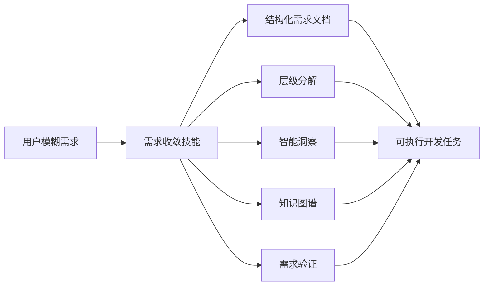
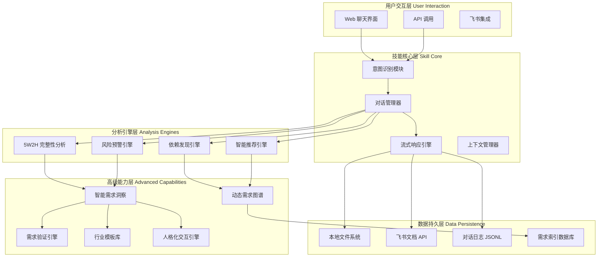
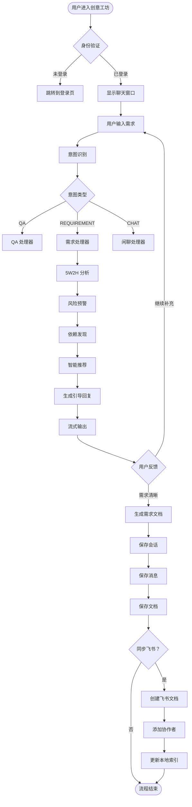
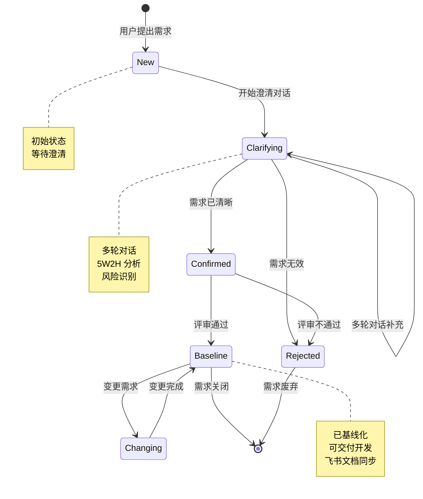
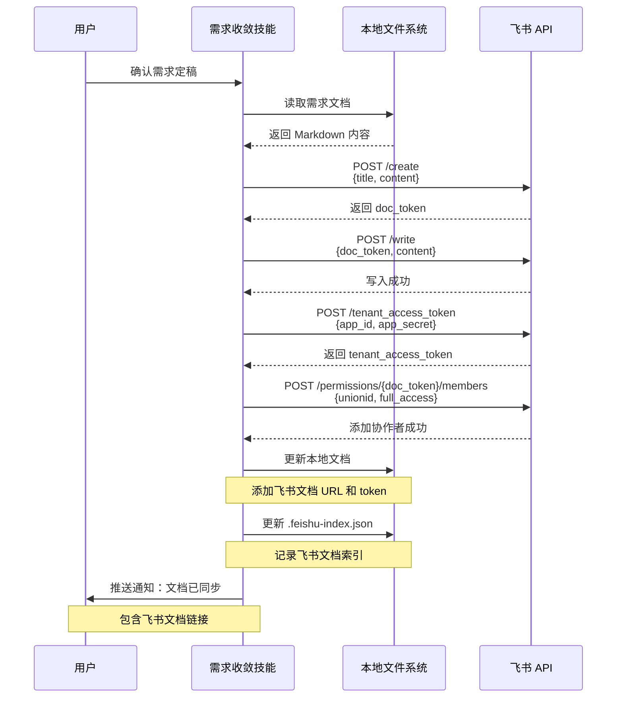

# 需求收敛技能 (Requirement Convergence Skill) - 系统架构与业务流程概览

> 文档版本：2.0.0  
> 生成时间：2026-03-18  
> 技能版本：v2.0.0  
> 基于文件：`ai-contest-web/server/services/requirement-convergence/SKILL.md`

---

## 一、技能概述

### 1.1 技能定位

需求收敛技能是一个**专业的需求分析助手**，通过启发式对话帮助用户澄清模糊需求、记录结构化需求、进行层级分解，并提供智能洞察、知识图谱、需求验证等高级能力。

### 1.2 核心价值



**核心价值主张：**
- 📊 **需求完整性提升**：从模糊想法到完整需求规格
- 🔍 **风险提前识别**：检测模糊表述、逻辑冲突、资源约束
- 🔗 **依赖关系发现**：自动识别外部系统、数据源、前置后置条件
- 💡 **最佳实践推荐**：基于历史需求库和行业标准
- 📝 **自动化文档**：生成结构化需求文档，支持飞书同步

---

## 二、技术架构

### 2.1 总体架构图



### 2.2 分层架构详解

```
┌─────────────────────────────────────────────────────────────┐
│                    用户交互层 User Interaction               │
│  ┌─────────────────┐  ┌─────────────────┐  ┌─────────────┐ │
│  │ Web 聊天界面     │  │ API 调用         │  │ 飞书集成     │ │
│  │ - Vue 3 前端     │  │ - RESTful API   │  │ - 文档同步   │ │
│  │ - 流式显示      │  │ - WebSocket     │  │ - 协作者管理 │ │
│  │ - Markdown 渲染  │  │ - SSE          │  │ - 权限控制   │ │
│  └─────────────────┘  └─────────────────┘  └─────────────┘ │
└─────────────────────────────────────────────────────────────┘
                            ↓
┌─────────────────────────────────────────────────────────────┐
│                    技能核心层 Skill Core                     │
│  ┌──────────────────────────────────────────────────────┐   │
│  │ 意图识别模块 (intentRecognizer.js)                    │   │
│  │ - 规则匹配 + 关键词分析                               │   │
│  │ - 三种意图：QA / REQUIREMENT / CHAT                   │   │
│  │ - 置信度评分                                          │   │
│  └──────────────────────────────────────────────────────┘   │
│  ┌──────────────────────────────────────────────────────┐   │
│  │ 对话管理器 (skillService.js)                          │   │
│  │ - 会话状态管理                                        │   │
│  │ - 上下文追踪                                          │   │
│  │ - 多轮对话协调                                        │   │
│  └──────────────────────────────────────────────────────┘   │
│  ┌──────────────────────────────────────────────────────┐   │
│  │ 流式响应引擎                                          │   │
│  │ - SSE (Server-Sent Events)                           │   │
│  │ - 打字机效果模拟                                      │   │
│  │ - 分块输出优化                                        │   │
│  └──────────────────────────────────────────────────────┘   │
└─────────────────────────────────────────────────────────────┘
                            ↓
┌─────────────────────────────────────────────────────────────┐
│                  分析引擎层 Analysis Engines                 │
│  ┌──────────────────────────────────────────────────────┐   │
│  │ 5W2H 完整性分析引擎                                     │   │
│  │ - Who (目标用户) - 权重 15%                           │   │
│  │ - What (功能需求) - 权重 20%                          │   │
│  │ - Why (业务价值) - 权重 15%                           │   │
│  │ - When (时间节点) - 权重 10%                          │   │
│  │ - Where (使用场景) - 权重 10%                         │   │
│  │ - How (实现方式) - 权重 15%                           │   │
│  │ - HowMuch (成本资源) - 权重 15%                       │   │
│  └──────────────────────────────────────────────────────┘   │
│  ┌──────────────────────────────────────────────────────┐   │
│  │ 风险预警引擎                                          │   │
│  │ - 模糊表述检测 (可能/大概/尽快)                       │   │
│  │ - 潜在冲突识别 (所有/必须/绝对)                       │   │
│  │ - 依赖风险分析                                        │   │
│  │ - 资源约束评估                                        │   │
│  └──────────────────────────────────────────────────────┘   │
│  ┌──────────────────────────────────────────────────────┐   │
│  │ 依赖发现引擎                                          │   │
│  │ - 外部系统依赖 (API/第三方/集成)                      │   │
│  │ - 数据源依赖 (数据库/文件/导入)                       │   │
│  │ - 前置条件 (前提/需要先)                              │   │
│  │ - 后置依赖 (后续/然后)                                │   │
│  └──────────────────────────────────────────────────────┘   │
│  ┌──────────────────────────────────────────────────────┐   │
│  │ 智能推荐引擎                                          │   │
│  │ - 相似度匹配算法                                      │   │
│  │ - 历史需求检索                                        │   │
│  │ - 最佳实践推荐                                        │   │
│  │ - 行业模板匹配                                        │   │
│  └──────────────────────────────────────────────────────┘   │
└─────────────────────────────────────────────────────────────┘
                            ↓
┌─────────────────────────────────────────────────────────────┐
│                高级能力层 Advanced Capabilities              │
│  ┌──────────────────────────────────────────────────────┐   │
│  │ 智能需求洞察 (insight-engine.ts)                      │   │
│  │ - 完整性评估：七维度自动评分                          │   │
│  │ - 风险预警：检测模糊词汇、逻辑冲突                    │   │
│  │ - 依赖发现：识别外部系统、数据源                      │   │
│  │ - 智能推荐：基于相似度匹配历史需求                    │   │
│  └──────────────────────────────────────────────────────┘   │
│  ┌──────────────────────────────────────────────────────┐   │
│  │ 动态需求图谱 (knowledge-graph/)                       │   │
│  │ - graph-model.ts：图谱数据模型                        │   │
│  │ - relationship-discovery.ts：关系发现                 │   │
│  │ - impact-analysis.ts：影响分析                        │   │
│  │ - version-comparison.ts：版本对比                     │   │
│  │ - reuse-discovery.ts：复用发现                        │   │
│  └──────────────────────────────────────────────────────┘   │
│  ┌──────────────────────────────────────────────────────┐   │
│  │ 需求验证引擎 (validation-engine/)                     │   │
│  │ - testability-checker.ts：可测试性检查                │   │
│  │ - acceptance-criteria.ts：验收标准生成                │   │
│  │ - traceability-manager.ts：追溯链管理                 │   │
│  │ - quality-scorer.ts：质量评分                         │   │
│  └──────────────────────────────────────────────────────┘   │
│  ┌──────────────────────────────────────────────────────┐   │
│  │ 行业模板库 (template-library/)                        │   │
│  │ - industry-templates.ts：行业模板                     │   │
│  │ - compliance-checker.ts：合规检查                     │   │
│  │ - best-practices.ts：最佳实践                         │   │
│  │ - anti-patterns.ts：反模式检测                        │   │
│  └──────────────────────────────────────────────────────┘   │
│  ┌──────────────────────────────────────────────────────┐   │
│  │ 人格化交互引擎 (persona-engine/)                      │   │
│  │ - persona-manager.ts：角色管理                        │   │
│  │ - context-memory.ts：上下文记忆                       │   │
│  │ - learning-engine.ts：学习引擎                        │   │
│  │ - proactive-notifier.ts：主动提醒                     │   │
│  └──────────────────────────────────────────────────────┘   │
└─────────────────────────────────────────────────────────────┘
                            ↓
┌─────────────────────────────────────────────────────────────┐
│                  数据持久层 Data Persistence                 │
│  ┌──────────────────────────────────────────────────────┐   │
│  │ 本地文件系统                                           │   │
│  │ - requirements/                                      │   │
│  │   ├─ communications/  对话记录                       │   │
│  │   ├─ breakdown/       层级分解                       │   │
│  │   ├─ specifications/  需求规格                       │   │
│  │   ├─ decisions/       决策记录                       │   │
│  │   ├─ research/        方案调研                       │   │
│  │   ├─ insights/        智能洞察                       │   │
│  │   ├─ knowledge-graph/ 需求图谱                       │   │
│  │   ├─ validation/      需求验证                       │   │
│  │   ├─ templates/       行业模板                       │   │
│  │   └─ persona/         人格化数据                       │   │
│  └──────────────────────────────────────────────────────┘   │
│  ┌──────────────────────────────────────────────────────┐   │
│  │ 飞书文档 API                                           │   │
│  │ - feishu_doc.create()：创建文档                       │   │
│  │ - feishu_doc.write()：写入内容                        │   │
│  │ - 添加协作者 API                                       │   │
│  │ - 权限管理                                             │   │
│  └──────────────────────────────────────────────────────┘   │
│  ┌──────────────────────────────────────────────────────┐   │
│  │ 对话日志 JSONL                                         │   │
│  │ - transcript.jsonl：原始对话记录                      │   │
│  │ - 格式：{"timestamp", "role", "message_id", "content"}│   │
│  └──────────────────────────────────────────────────────┘   │
│  ┌──────────────────────────────────────────────────────┐   │
│  │ 索引数据库                                             │   │
│  │ - .meta.json：ID 追踪                                  │   │
│  │ - .feishu-index.json：飞书文档索引                    │   │
│  └──────────────────────────────────────────────────────┘   │
└─────────────────────────────────────────────────────────────┘
```

---

## 三、核心模块详解

### 3.1 意图识别模块 (Intent Recognizer)

**文件路径：** `server/services/intentRecognizer.js`

**功能描述：**
识别用户输入的意图类型，分发到不同的处理器。

**意图类型：**

| 类型 | 标识 | 触发条件 | 处理器 |
|------|------|----------|--------|
| QA 问答 | `QA` | 明确问题、寻求答案 | handleQA() |
| 需求分析 | `REQUIREMENT` | "我有个想法"/"我想做 xxx" | handleRequirement() |
| 闲聊 | `CHAT` | 打招呼、闲聊 | handleChat() |

**识别算法：**

```javascript
// 1. 关键词匹配
const qaKeywords = ['怎么', '如何', '为什么', '什么', '多少', '何时', '哪里']
const requirementKeywords = ['我想', '我需要', '做个', '开发', '实现', '需求', '功能']
const chatKeywords = ['你好', '您好', '早', '好', '谢谢', '再见']

// 2. 模式匹配
const patterns = {
  QA: [/怎么.*\?/, /如何.*\?/, /为什么.*\?/],
  REQUIREMENT: [/我想.*系统/, /做个.*功能/, /开发.*应用/],
  CHAT: [/^你好/, /^您好/, /^早/]
}

// 3. 置信度计算
const confidence = matchCount / totalKeywords
```

**输出格式：**

```javascript
{
  type: 'REQUIREMENT',  // 意图类型
  confidence: 0.85,     // 置信度 (0-1)
  keywords: ['我想', '系统'],  // 匹配关键词
  patterns: [/我想.*系统/]  // 匹配模式
}
```

---

### 3.2 技能服务核心 (Skill Service)

**文件路径：** `server/services/skillService.js`

**核心类：** `SkillService`

**主要方法：**

```javascript
class SkillService {
  // 初始化服务
  async initialize()
  
  // 处理用户消息
  async processMessage(userMessage, conversationHistory)
  
  // 构建消息上下文
  buildMessages(userMessage, conversationHistory, intentType)
  
  // 调用 AI API
  async callChatAPI(messages, stream)
  
  // 流式响应
  async *streamResponse(userMessage, conversationHistory)
  
  // 意图处理器
  async *handleQA(userMessage, conversationHistory)
  async *handleRequirement(userMessage, conversationHistory)
  async *handleChat(userMessage, conversationHistory)
  
  // 需求分析核心方法
  formatRequirementAnalysis(analysis, originalMessage)
  formatCompletenessSection(score, missingElements, detailedScore)
  formatRiskSection(riskItems, overallRiskLevel)
  formatDependencySection(depList)
  formatRecommendationSection(recList, bestPractices)
  formatGuidingQuestions(questions)
  
  // 行业案例提取
  extractIndustryCases(requirement, recommendations)
  formatIndustryCases(industryCases)
  
  // 引导性问题生成
  generateGuidingQuestions(requirement, analysis)
  generateDefaultResponse(originalMessage)
}
```

**系统提示词模板：**

```javascript
// 需求分析角色
const REQUIREMENT_PROMPT = `
你是一个专业的需求分析师，擅长通过启发式对话帮助用户澄清和收敛模糊需求。

你的职责：
1. 主动提问，引导用户补充关键信息
2. 识别需求中的模糊点和矛盾点
3. 帮助用户梳理用户故事、功能清单和验收标准
4. 在适当时机生成结构化的需求文档

请保持专业、友好的语气，使用中文回复。
`

// QA 角色
const QA_PROMPT = `
你是一个专业的助手，请直接、简洁地回答用户的问题。
`

// 闲聊角色
const CHAT_PROMPT = `
你是一个友好的需求分析助手。与用户友好交流，并引导他们说明具体需求。
`
```

---

### 3.3 5W2H 分析引擎

**分析框架：**

```javascript
const fiveW2H = {
  Who: { 
    keywords: ['用户', '角色', '管理员', '客户', '员工'], 
    weight: 15 
  },
  What: { 
    keywords: ['功能', '需求', '实现', '系统', '模块'], 
    weight: 20 
  },
  Why: { 
    keywords: ['目的', '价值', '目标', '解决', '提升'], 
    weight: 15 
  },
  When: { 
    keywords: ['时间', '节点', '阶段', '上线', '交付'], 
    weight: 10 
  },
  Where: { 
    keywords: ['场景', '环境', '平台', '端', '位置'], 
    weight: 10 
  },
  How: { 
    keywords: ['方式', '方法', '技术', '方案', '流程'], 
    weight: 15 
  },
  HowMuch: { 
    keywords: ['成本', '预算', '资源', '人力', '时间'], 
    weight: 15 
  }
}
```

**评分算法：**

```javascript
function analyzeRequirement(req) {
  const lowerReq = req.toLowerCase()
  const scores = {}
  let totalScore = 0

  for (const [dimension, config] of Object.entries(fiveW2H)) {
    // 计算关键词匹配数
    const matchCount = config.keywords
      .filter(kw => lowerReq.includes(kw.toLowerCase()))
      .length
    
    // 维度得分 (满分 100)
    scores[dimension] = Math.min(100, matchCount * 30)
    
    // 加权总分
    totalScore += scores[dimension] * config.weight
  }

  // 归一化总分
  totalScore = Math.round(totalScore / 100)

  // 识别缺失维度
  const missingElements = []
  for (const [dimension, score] of Object.entries(scores)) {
    if (score < 50) {
      missingElements.push(`${dimension}维度需要补充`)
    }
  }

  return {
    completeness: {
      score: { totalScore, ...scores },
      missingElements
    }
  }
}
```

**输出示例：**

```json
{
  "completeness": {
    "score": {
      "totalScore": 65,
      "who": 80,
      "what": 90,
      "why": 40,
      "when": 20,
      "where": 60,
      "how": 70,
      "howMuch": 30
    },
    "missingElements": [
      "Why 维度需要补充",
      "When 维度需要补充",
      "HowMuch 维度需要补充"
    ]
  }
}
```

---

### 3.4 风险预警引擎

**风险模式库：**

```javascript
const riskPatterns = [
  {
    pattern: /可能 | 也许 | 大概/i,
    type: 'vague',
    level: 'medium',
    suggestion: '请明确表述'
  },
  {
    pattern: /尽快 | 及时 | 快速/i,
    type: 'vague',
    level: 'low',
    suggestion: '请提供具体时间要求'
  },
  {
    pattern: /简单 | 容易 | 方便/i,
    type: 'vague',
    level: 'low',
    suggestion: '请定义具体的易用性标准'
  },
  {
    pattern: /所有 | 全部 | 每一个/i,
    type: 'conflict',
    level: 'high',
    suggestion: '请明确范围边界'
  },
  {
    pattern: /必须 | 一定 | 绝对/i,
    type: 'conflict',
    level: 'medium',
    suggestion: '请说明强制性的原因'
  }
]
```

**风险分析算法：**

```javascript
function analyzeRisks(req) {
  const risks = []
  
  for (const { pattern, type, level, suggestion } of riskPatterns) {
    const matches = req.match(pattern)
    if (matches) {
      risks.push({
        type,
        level,
        description: `发现模糊表述："${matches[0]}"`,
        suggestion
      })
    }
  }

  // 计算整体风险等级
  const overallRiskLevel = risks.length > 3 
    ? 'high' 
    : risks.length > 1 
      ? 'medium' 
      : 'low'

  return {
    risks,
    overallRiskLevel,
    riskWarning: { overallRiskLevel }
  }
}
```

**风险等级说明：**

| 等级 | 标识 | 风险数量 | 处理建议 |
|------|------|----------|----------|
| 高 | 🔴 | > 3 | 需要重点澄清 |
| 中 | 🟡 | 2-3 | 建议补充细节 |
| 低 | 🟢 | 0-1 | 风险可控 |

---

### 3.5 依赖发现引擎

**依赖类型：**

```javascript
const dependencyKeywords = {
  external_system: ['接口', 'API', '第三方', '外部', '集成'],
  data_source: ['数据', '数据库', '存储', '文件', '导入'],
  precondition: ['前提', '前置', '先决', '需要先', '必须先'],
  postcondition: ['后续', '之后', '然后', '接着']
}
```

**依赖发现算法：**

```javascript
function discoverDependencies(req) {
  const dependencies = []
  const lowerReq = req.toLowerCase()

  for (const [type, keywords] of Object.entries(dependencyKeywords)) {
    for (const kw of keywords) {
      if (lowerReq.includes(kw.toLowerCase())) {
        dependencies.push({
          type,
          name: `依赖${kw}`,
          description: `需求中提到"${kw}"，可能存在${type}依赖`,
          isRequired: true
        })
        break
      }
    }
  }

  return {
    dependencies,
    total: dependencies.length
  }
}
```

**依赖关系分类：**

| 类型 | 说明 | 示例 |
|------|------|------|
| external_system | 外部系统/服务 | 支付接口、短信服务、第三方 API |
| data_source | 数据源 | 数据库、Excel 导入、文件存储 |
| precondition | 前置条件 | 需要先登录、必须完成认证 |
| postcondition | 后置依赖 | 后续需要审批、然后发送邮件 |

---

### 3.6 智能推荐引擎

**推荐策略：**

```javascript
async function recommend(requirement, limit = 5) {
  // 1. 提取需求特征
  const features = extractFeatures(requirement)
  
  // 2. 检索历史需求库
  const historicalReqs = await searchHistoricalRequirements(features)
  
  // 3. 计算相似度
  const similarities = historicalReqs.map(req => ({
    requirement: req,
    similarity: calculateSimilarity(features, req.features)
  }))
  
  // 4. 过滤和排序
  const filtered = similarities
    .filter(s => s.similarity > 0.6)
    .sort((a, b) => b.similarity - a.similarity)
    .slice(0, limit)
  
  // 5. 提取最佳实践
  const bestPractices = extractBestPractices(filtered)
  
  // 6. 匹配行业模板
  const relatedTemplates = matchIndustryTemplates(features)
  
  return {
    recommendations: filtered,
    bestPractices,
    relatedTemplates
  }
}
```

**相似度计算：**

```javascript
function calculateSimilarity(featuresA, featuresB) {
  // 1. 关键词重叠度
  const keywordOverlap = jaccardSimilarity(
    featuresA.keywords,
    featuresB.keywords
  )
  
  // 2. 行业匹配度
  const industryMatch = featuresA.industry === featuresB.industry ? 1 : 0
  
  // 3. 功能类型匹配
  const functionMatch = featuresA.functionType === featuresB.functionType ? 1 : 0.5
  
  // 4. 加权相似度
  const similarity = (
    keywordOverlap * 0.6 +
    industryMatch * 0.25 +
    functionMatch * 0.15
  )
  
  return similarity
}

// Jaccard 相似度
function jaccardSimilarity(setA, setB) {
  const intersection = setA.filter(x => setB.includes(x)).length
  const union = new Set([...setA, ...setB]).size
  return intersection / union
}
```

---

## 四、高级能力详解

### 4.1 智能需求洞察 (Insight Engine)

**文件路径：** `requirement-convergence/src/insight-engine/insight-engine.ts`

**核心功能：**

```typescript
interface InsightResult {
  completeness: {
    score: {
      totalScore: number
      who: number
      what: number
      why: number
      when: number
      where: number
      how: number
      howMuch: number
    }
    missingElements: string[]
  }
  riskWarning: {
    overallRiskLevel: 'high' | 'medium' | 'low'
    risks: RiskItem[]
  }
  dependencies: {
    dependencies: Dependency[]
    total: number
  }
  recommendations: {
    recommendations: Recommendation[]
    bestPractices: string[]
    relatedRequirements: RelatedRequirement[]
  }
}

// API 调用示例
const insightResult = analyzeRequirement(requirement)
console.log('完整性评分:', insightResult.completeness.score.totalScore)
console.log('风险等级:', insightResult.riskWarning.overallRiskLevel)
console.log('依赖数量:', insightResult.dependencies.total)
console.log('推荐数量:', insightResult.recommendations.recommendations.length)
```

**使用场景：**
- 需求完整性自动评估
- 风险提前预警
- 依赖关系识别
- 最佳实践推荐

---

### 4.2 动态需求图谱 (Knowledge Graph)

**文件路径：** `requirement-convergence/src/knowledge-graph/`

**核心模块：**

| 模块 | 文件 | 功能 |
|------|------|------|
| 图谱模型 | graph-model.ts | 需求节点、边、关系定义 |
| 关系发现 | relationship-discovery.ts | 自动识别需求间关系 |
| 影响分析 | impact-analysis.ts | 评估变更影响范围 |
| 版本对比 | version-comparison.ts | 追踪需求演进历史 |
| 复用发现 | reuse-discovery.ts | 识别可复用需求模式 |

**图谱数据结构：**

```typescript
interface RequirementNode {
  id: string              // 需求 ID (如 REQ-2026-001)
  title: string           // 需求标题
  description: string     // 需求描述
  type: RequirementType   // 功能/非功能/业务/技术
  priority: Priority      // HIGH/MEDIUM/LOW
  status: Status          // NEW/CLARIFYING/BASELINE/CHANGING/CLOSED
  metadata: {
    createdAt: Date
    updatedAt: Date
    createdBy: string
    tags: string[]
  }
}

interface RequirementEdge {
  source: string          // 源需求 ID
  target: string          // 目标需求 ID
  type: EdgeType          // DEPENDS_ON/CONFLICTS_WITH/REFERENCES/DERIVES_FROM
  strength: number        // 关系强度 (0-1)
  metadata: {
    description: string
    createdAt: Date
  }
}

interface RequirementGraph {
  nodes: RequirementNode[]
  edges: RequirementEdge[]
  metadata: {
    createdAt: Date
    version: string
  }
}
```

**关系发现算法：**

```typescript
function discoverRelationships(requirements: RequirementNode[]): RequirementEdge[] {
  const edges: RequirementEdge[] = []
  
  for (let i = 0; i < requirements.length; i++) {
    for (let j = i + 1; j < requirements.length; j++) {
      const reqA = requirements[i]
      const reqB = requirements[j]
      
      // 1. 依赖关系检测
      if (hasDependency(reqA, reqB)) {
        edges.push({
          source: reqA.id,
          target: reqB.id,
          type: 'DEPENDS_ON',
          strength: calculateDependencyStrength(reqA, reqB),
          metadata: {
            description: `${reqA.title} 依赖 ${reqB.title}`,
            createdAt: new Date()
          }
        })
      }
      
      // 2. 冲突关系检测
      if (hasConflict(reqA, reqB)) {
        edges.push({
          source: reqA.id,
          target: reqB.id,
          type: 'CONFLICTS_WITH',
          strength: calculateConflictStrength(reqA, reqB),
          metadata: {
            description: `${reqA.title} 与 ${reqB.title} 存在冲突`,
            createdAt: new Date()
          }
        })
      }
      
      // 3. 引用关系检测
      if (hasReference(reqA, reqB)) {
        edges.push({
          source: reqA.id,
          target: reqB.id,
          type: 'REFERENCES',
          strength: 0.8,
          metadata: {
            description: `${reqA.title} 引用 ${reqB.title}`,
            createdAt: new Date()
          }
        })
      }
    }
  }
  
  return edges
}
```

**影响分析：**

```typescript
interface ImpactAnalysisResult {
  directImpact: RequirementNode[]      // 直接影响的需求
  indirectImpact: RequirementNode[]    // 间接影响的需求
  impactPaths: ImpactPath[]            // 影响传播路径
  riskLevel: 'HIGH' | 'MEDIUM' | 'LOW' // 风险等级
  report: string                       // 影响分析报告
}

function analyzeRequirementImpact(
  requirementId: string,
  graph: RequirementGraph
): ImpactAnalysisResult {
  // 1. 找到直接影响的需求
  const directImpact = findDirectDependencies(requirementId, graph)
  
  // 2. BFS 遍历找到间接影响
  const indirectImpact = findIndirectDependencies(directImpact, graph)
  
  // 3. 构建影响传播路径
  const impactPaths = buildImpactPaths(requirementId, graph)
  
  // 4. 评估风险等级
  const riskLevel = evaluateImpactRisk(directImpact.length, indirectImpact.length)
  
  // 5. 生成影响分析报告
  const report = generateImpactReport(requirementId, {
    directImpact,
    indirectImpact,
    impactPaths,
    riskLevel
  })
  
  return {
    directImpact,
    indirectImpact,
    impactPaths,
    riskLevel,
    report
  }
}
```

---

### 4.3 需求验证引擎 (Validation Engine)

**文件路径：** `requirement-convergence/src/validation-engine/`

**核心模块：**

| 模块 | 文件 | 功能 |
|------|------|------|
| 可测试性检查 | testability-checker.ts | 评估需求是否可测试 |
| 验收标准生成 | acceptance-criteria.ts | 生成 Given-When-Then 格式 |
| 追溯链管理 | traceability-manager.ts | 建立需求 - 测试追溯关系 |
| 质量评分 | quality-scorer.ts | 综合质量评估 |

**可测试性检查：**

```typescript
interface TestabilityReport {
  overallScore: number        // 总体评分 (0-100)
  isTestable: boolean         // 是否可测试
  issues: TestabilityIssue[]  // 发现的问题
  suggestions: string[]       // 改进建议
  report: string              // 详细报告
}

function checkTestability(requirement: string): TestabilityReport {
  const issues: TestabilityIssue[] = []
  const suggestions: string[] = []
  
  // 1. 检查是否包含可量化指标
  if (!hasQuantifiableMetrics(requirement)) {
    issues.push({
      type: 'MISSING_METRICS',
      severity: 'HIGH',
      description: '需求缺少可量化的验收指标'
    })
    suggestions.push('添加具体的性能指标，如"响应时间<2 秒"')
  }
  
  // 2. 检查是否包含模糊词汇
  const vagueWords = detectVagueWords(requirement)
  if (vagueWords.length > 0) {
    issues.push({
      type: 'VAGUE_LANGUAGE',
      severity: 'MEDIUM',
      description: `发现模糊表述：${vagueWords.join(', ')}`
    })
    suggestions.push('使用明确的、可衡量的描述')
  }
  
  // 3. 检查是否包含验收条件
  if (!hasAcceptanceCriteria(requirement)) {
    issues.push({
      type: 'MISSING_CRITERIA',
      severity: 'HIGH',
      description: '需求缺少明确的验收条件'
    })
    suggestions.push('添加 Given-When-Then 格式的验收标准')
  }
  
  // 4. 计算评分
  const overallScore = calculateTestabilityScore(issues)
  const isTestable = overallScore >= 60
  
  return {
    overallScore,
    isTestable,
    issues,
    suggestions,
    report: generateTestabilityReport(overallScore, issues, suggestions)
  }
}
```

**验收标准生成：**

```typescript
interface AcceptanceCriteriaSet {
  requirementId: string
  scenarios: Scenario[]
  totalScenarios: number
  coverage: number
}

interface Scenario {
  id: string
  given: string      // 前置条件
  when: string       // 操作
  then: string       // 预期结果
  type: 'happy' | 'edge' | 'error'
}

function generateAcceptanceCriteria(
  requirementId: string,
  requirement: string
): AcceptanceCriteriaSet {
  const scenarios: Scenario[] = []
  
  // 1. 提取需求要素
  const elements = extractRequirementElements(requirement)
  
  // 2. 生成主流程场景 (Happy Path)
  scenarios.push({
    id: `${requirementId}-SC001`,
    given: elements.precoditions || '系统正常运行',
    when: elements.action,
    then: elements.expectedOutcome,
    type: 'happy'
  })
  
  // 3. 生成边界场景 (Edge Cases)
  const edgeCases = identifyEdgeCases(elements)
  edgeCases.forEach((edge, index) => {
    scenarios.push({
      id: `${requirementId}-SC00${index + 2}`,
      given: edge.precodition,
      when: edge.action,
      then: edge.expectedResult,
      type: 'edge'
    })
  })
  
  // 4. 生成错误场景 (Error Cases)
  const errorCases = identifyErrorCases(elements)
  errorCases.forEach((error, index) => {
    scenarios.push({
      id: `${requirementId}-SC${10 + index + 1}`,
      given: error.precodition,
      when: error.invalidAction,
      then: error.errorHandling,
      type: 'error'
    })
  })
  
  return {
    requirementId,
    scenarios,
    totalScenarios: scenarios.length,
    coverage: calculateCoverage(scenarios)
  }
}
```

**质量评分：**

```typescript
interface QualityReport {
  overallScore: number      // 综合评分 (0-100)
  qualityGrade: string      // 质量等级 (A/B/C/D)
  dimensions: {             // 各维度评分
    completeness: number    // 完整性
    consistency: number     // 一致性
    testability: number     // 可测试性
    traceability: number    // 可追溯性
  }
  issues: QualityIssue[]
  recommendations: string[]
}

function scoreRequirementQuality(
  requirementId: string,
  requirement: string
): QualityReport {
  // 1. 完整性评分
  const completenessScore = evaluateCompleteness(requirement)
  
  // 2. 一致性评分
  const consistencyScore = evaluateConsistency(requirement)
  
  // 3. 可测试性评分
  const testabilityReport = checkTestability(requirement)
  const testabilityScore = testabilityReport.overallScore
  
  // 4. 可追溯性评分
  const traceabilityScore = evaluateTraceability(requirementId)
  
  // 5. 计算综合评分 (加权平均)
  const overallScore = Math.round(
    completenessScore * 0.3 +
    consistencyScore * 0.25 +
    testabilityScore * 0.25 +
    traceabilityScore * 0.2
  )
  
  // 6. 确定质量等级
  const qualityGrade = calculateQualityGrade(overallScore)
  
  // 7. 识别问题
  const issues = identifyQualityIssues({
    completenessScore,
    consistencyScore,
    testabilityScore,
    traceabilityScore
  })
  
  // 8. 生成改进建议
  const recommendations = generateRecommendations(issues)
  
  return {
    overallScore,
    qualityGrade,
    dimensions: {
      completeness: completenessScore,
      consistency: consistencyScore,
      testability: testabilityScore,
      traceability: traceabilityScore
    },
    issues,
    recommendations
  }
}

function calculateQualityGrade(score: number): string {
  if (score >= 90) return 'A'  // 优秀
  if (score >= 80) return 'B'  // 良好
  if (score >= 70) return 'C'  // 合格
  if (score >= 60) return 'D'  // 需改进
  return 'F'                    // 不合格
}
```

---

### 4.4 行业模板库 (Template Library)

**文件路径：** `requirement-convergence/src/template-library/`

**核心模块：**

| 模块 | 文件 | 功能 |
|------|------|------|
| 行业模板 | industry-templates.ts | 电商/金融/医疗等行业模板 |
| 合规检查 | compliance-checker.ts | GDPR/PIPL 等合规检查 |
| 最佳实践 | best-practices.ts | 分场景最佳实践 |
| 反模式检测 | anti-patterns.ts | 识别常见需求陷阱 |

**行业模板分类：**

```typescript
interface IndustryTemplate {
  id: string
  industry: string          // 行业：ecommerce/finance/legal/healthcare
  scenario: string          // 场景：user-registration/order-payment/contract-review
  template: RequirementTemplate
  bestPractices: string[]
  complianceStandards: string[]
}

const industryTemplates: IndustryTemplate[] = [
  {
    id: 'tmpl-ecommerce-001',
    industry: 'ecommerce',
    scenario: 'user-registration',
    template: {
      // 电商用户注册模板
      userStories: [...],
      functionalRequirements: [...],
      nonFunctionalRequirements: [...],
      acceptanceCriteria: [...]
    },
    bestPractices: [
      '使用滑块验证码防止恶意注册',
      '实现风险 IP 识别和拦截',
      '提供多种注册方式 (手机/邮箱/第三方)'
    ],
    complianceStandards: ['网络安全法', '个人信息保护法']
  },
  {
    id: 'tmpl-legal-001',
    industry: 'legal',
    scenario: 'contract-review',
    template: {
      // 法务合同审查模板
      userStories: [...],
      functionalRequirements: [...],
      nonFunctionalRequirements: [...],
      acceptanceCriteria: [...]
    },
    bestPractices: [
      'NLP 技术自动识别合同类型',
      '基于规则引擎的风险条款检测',
      '审查意见可追溯和版本管理'
    ],
    complianceStandards: ['律师法', '合同法']
  }
]
```

**合规检查：**

```typescript
interface ComplianceReport {
  requirement: string
  standards: string[]       // 检查的合规标准
  passRate: number          // 合规通过率
  violations: Violation[]   // 违规项
  recommendations: string[] // 合规建议
}

function checkCompliance(
  requirement: string,
  standards: string[] = ['GDPR', 'PIPL']
): ComplianceReport {
  const violations: Violation[] = []
  
  // 1. GDPR 检查
  if (standards.includes('GDPR')) {
    const gdprViolations = checkGDPR(requirement)
    violations.push(...gdprViolations)
  }
  
  // 2. PIPL (个人信息保护法) 检查
  if (standards.includes('PIPL')) {
    const piplViolations = checkPIPL(requirement)
    violations.push(...piplViolations)
  }
  
  // 3. 计算合规率
  const totalChecks = standards.length * 10  // 假设每个标准 10 项检查
  const passedChecks = totalChecks - violations.length
  const passRate = Math.round((passedChecks / totalChecks) * 100)
  
  // 4. 生成合规建议
  const recommendations = generateComplianceRecommendations(violations)
  
  return {
    requirement,
    standards,
    passRate,
    violations,
    recommendations
  }
}

function checkGDPR(requirement: string): Violation[] {
  const violations: Violation[] = []
  
  // GDPR 关键检查项
  const gdprChecks = [
    {
      rule: /收集.*个人信息/,
      requirement: '需要明确数据收集目的和范围',
      severity: 'HIGH'
    },
    {
      rule: /存储.*用户数据/,
      requirement: '需要说明数据保留期限',
      severity: 'MEDIUM'
    },
    {
      rule: /删除.*账户/,
      requirement: '需要提供数据删除机制 (被遗忘权)',
      severity: 'HIGH'
    }
  ]
  
  for (const check of gdprChecks) {
    if (check.rule.test(requirement)) {
      if (!hasCorrespondingClause(requirement, check.requirement)) {
        violations.push({
          standard: 'GDPR',
          article: getGDPRArticle(check.requirement),
          description: check.requirement,
          severity: check.severity,
          evidence: requirement.match(check.rule)?.[0]
        })
      }
    }
  }
  
  return violations
}
```

**反模式检测：**

```typescript
interface AntiPattern {
  id: string
  name: string
  description: string
  symptoms: string[]
  consequences: string[]
  solution: string
  example: string
}

const antiPatterns: AntiPattern[] = [
  {
    id: 'AP-001',
    name: '模糊需求',
    description: '需求描述不清晰，无法准确理解',
    symptoms: ['使用"可能"、"大概"、"尽快"等模糊词汇', '缺少具体指标'],
    consequences: ['开发理解偏差', '验收标准不明确', '项目延期'],
    solution: '使用 SMART 原则：具体、可衡量、可实现、相关性、时限性',
    example: '❌ "系统要快速响应" → ✅ "95% 的请求响应时间<500ms"'
  },
  {
    id: 'AP-002',
    name: '范围蔓延',
    description: '需求范围不断扩大，没有明确边界',
    symptoms: ['频繁添加新功能', '缺少优先级', '资源不足'],
    consequences: ['项目失控', '质量下降', '团队疲惫'],
    solution: '使用 MoSCoW 优先级：Must/Should/Could/Won\'t',
    example: '明确 Must 功能：没有就不能上线的核心功能'
  },
  {
    id: 'AP-003',
    name: '技术驱动需求',
    description: '从技术方案出发而非业务需求',
    symptoms: ['强调使用某技术', '缺少业务价值说明', '解决方案先行'],
    consequences: ['技术与业务脱节', '过度设计', '维护困难'],
    solution: '从业务目标出发，先定义 What 和 Why，再考虑 How',
    example: '❌ "用区块链实现" → ✅ "需要不可篡改的审计日志"'
  }
]

function detectAntiPatterns(requirement: string): AntiPattern[] {
  const detected: AntiPattern[] = []
  
  for (const pattern of antiPatterns) {
    if (matchesAntiPattern(requirement, pattern)) {
      detected.push(pattern)
    }
  }
  
  return detected
}
```

---

### 4.5 人格化交互引擎 (Persona Engine)

**文件路径：** `requirement-convergence/src/persona-engine/`

**核心模块：**

| 模块 | 文件 | 功能 |
|------|------|------|
| 角色管理 | persona-manager.ts | 分析师/引导者/质疑者/协调者 |
| 上下文记忆 | context-memory.ts | 用户偏好、历史决策、项目术语 |
| 学习引擎 | learning-engine.ts | 基于反馈优化交互策略 |
| 主动提醒 | proactive-notifier.ts | 待澄清事项、评审节点提醒 |

**角色定义：**

```typescript
interface Persona {
  id: string
  name: string
  description: string
  tone: string
  focus: string[]
  promptTemplate: string
}

const personas: Persona[] = [
  {
    id: 'analyst',
    name: '分析师',
    description: '专业的需求分析师，注重细节和完整性',
    tone: '专业、严谨、逻辑清晰',
    focus: ['完整性评估', '风险识别', '依赖分析'],
    promptTemplate: `
      你是一位经验丰富的需求分析师。
      你的职责是确保需求的完整性和准确性。
      你会：
      1. 仔细检查每个 5W2H 维度
      2. 识别潜在风险和依赖
      3. 提供结构化的需求文档
      
      保持专业、严谨的语气。
    `
  },
  {
    id: 'facilitator',
    name: '引导者',
    description: '温和的引导者，通过提问帮助用户理清思路',
    tone: '友好、耐心、善于引导',
    focus: ['启发式提问', '思路梳理', '鼓励表达'],
    promptTemplate: `
      你是一位温和的需求引导者。
      你的职责是通过提问帮助用户理清思路。
      你会：
      1. 提出开放性问题
      2. 鼓励用户表达想法
      3. 帮助用户发现盲点
      
      保持友好、耐心的语气。
    `
  },
  {
    id: 'challenger',
    name: '质疑者',
    description: '批判性思维者，挑战假设和边界',
    tone: '直接、尖锐、富有挑战性',
    focus: ['挑战假设', '边界测试', '极端场景'],
    promptTemplate: `
      你是一位批判性思维的需求质疑者。
      你的职责是挑战用户的假设和边界。
      你会：
      1. 质疑隐含假设
      2. 提出极端场景
      3. 测试需求边界
      
      保持直接、富有挑战性的语气。
    `
  },
  {
    id: 'coordinator',
    name: '协调者',
    description: '全局协调者，平衡各方利益',
    tone: '平衡、周全、注重共识',
    focus: ['利益相关者', '资源平衡', '优先级协调'],
    promptTemplate: `
      你是一位全局观的需求协调者。
      你的职责是平衡各方利益和资源。
      你会：
      1. 识别利益相关者
      2. 平衡资源约束
      3. 协调优先级冲突
      
      保持平衡、周全的语气。
    `
  }
]
```

**上下文记忆：**

```typescript
interface UserMemory {
  userId: string
  preferences: Preference[]
  decisions: Decision[]
  terminology: Terminology[]
  interactionHistory: InteractionRecord[]
}

interface Preference {
  category: string
  preference: string
  confidence: number  // 0-1
  updatedAt: Date
}

interface Decision {
  id: string
  requirementId: string
  decision: string
  rationale: string
  alternatives: string[]
  madeAt: Date
}

interface Terminology {
  term: string
  definition: string
  context: string
  usageCount: number
}

class ContextMemory {
  private memories: Map<string, UserMemory> = new Map()
  
  // 添加用户偏好
  addPreference(userId: string, preference: Preference) {
    const memory = this.getOrCreateMemory(userId)
    
    // 更新或添加偏好
    const existing = memory.preferences.find(p => p.category === preference.category)
    if (existing) {
      // 使用移动平均更新置信度
      existing.confidence = (existing.confidence * existing.usageCount + preference.confidence) / (existing.usageCount + 1)
      existing.updatedAt = new Date()
    } else {
      memory.preferences.push(preference)
    }
  }
  
  // 记录决策
  recordDecision(userId: string, decision: Decision) {
    const memory = this.getOrCreateMemory(userId)
    memory.decisions.push(decision)
  }
  
  // 获取用户画像摘要
  getUserProfile(userId: string): UserProfile {
    const memory = this.memories.get(userId)
    if (!memory) {
      return this.getDefaultProfile()
    }
    
    return {
      topPreferences: memory.preferences
        .sort((a, b) => b.confidence - a.confidence)
        .slice(0, 5),
      recentDecisions: memory.decisions
        .sort((a, b) => b.madeAt.getTime() - a.madeAt.getTime())
        .slice(0, 10),
      commonTerminology: memory.terminology
        .sort((a, b) => b.usageCount - a.usageCount)
        .slice(0, 20)
    }
  }
}
```

**学习引擎：**

```typescript
interface Feedback {
  interactionId: string
  feedbackType: 'positive' | 'negative'
  rating: number  // 1-5
  comment?: string
  timestamp: Date
}

interface LearningRecord {
  interactionId: string
  strategy: string
  outcome: 'success' | 'failure'
  lessons: string[]
  updatedAt: Date
}

class LearningEngine {
  private feedbackHistory: Feedback[] = []
  private learningRecords: LearningRecord[] = []
  
  // 记录反馈
  recordFeedback(feedback: Feedback) {
    this.feedbackHistory.push(feedback)
    
    // 分析反馈模式
    this.analyzeFeedbackPattern(feedback)
  }
  
  // 分析反馈模式
  private analyzeFeedbackPattern(feedback: Feedback) {
    // 1. 识别成功策略
    if (feedback.feedbackType === 'positive' && feedback.rating >= 4) {
      this.identifySuccessFactors(feedback.interactionId)
    }
    
    // 2. 识别改进点
    if (feedback.feedbackType === 'negative' || feedback.rating <= 2) {
      this.identifyImprovementAreas(feedback.interactionId)
    }
    
    // 3. 更新策略权重
    this.updateStrategyWeights()
  }
  
  // 获取最优策略
  getOptimalStrategy(context: string): string {
    // 基于历史反馈，选择在类似上下文中表现最好的策略
    const relevantRecords = this.learningRecords.filter(
      record => record.strategy.includes(context)
    )
    
    const successRate = relevantRecords
      .filter(r => r.outcome === 'success')
      .length / relevantRecords.length
    
    if (successRate > 0.7) {
      return '继续使用当前策略'
    } else {
      return '尝试替代策略'
    }
  }
}
```

**主动提醒：**

```typescript
interface Reminder {
  id: string
  type: ReminderType
  title: string
  description: string
  priority: 'high' | 'medium' | 'low'
  dueDate?: Date
  relatedRequirementId?: string
  createdAt: Date
}

type ReminderType = 
  | 'clarification_needed'    // 待澄清事项
  | 'review_scheduled'        // 评审节点
  | 'change_impact'           // 变更影响
  | 'dependency_blocked'      // 依赖阻塞
  | 'deadline_approaching'    // 截止日期临近

class ProactiveNotifier {
  private reminders: Reminder[] = []
  
  // 添加提醒
  addReminder(reminder: Reminder) {
    this.reminders.push(reminder)
    
    // 根据优先级决定是否立即通知
    if (reminder.priority === 'high') {
      this.sendImmediateNotification(reminder)
    }
  }
  
  // 检查待办事项
  checkPendingItems(requirementId: string): Reminder[] {
    return this.reminders.filter(
      r => r.relatedRequirementId === requirementId && 
           !this.isReminderCompleted(r)
    )
  }
  
  // 生成提醒摘要
  generateSummary(): ReminderSummary {
    const byPriority = {
      high: this.reminders.filter(r => r.priority === 'high'),
      medium: this.reminders.filter(r => r.priority === 'medium'),
      low: this.reminders.filter(r => r.priority === 'low')
    }
    
    const byType = {}
    for (const reminder of this.reminders) {
      if (!byType[reminder.type]) {
        byType[reminder.type] = []
      }
      byType[reminder.type].push(reminder)
    }
    
    return {
      total: this.reminders.length,
      byPriority,
      byType,
      overdue: this.reminders.filter(r => 
        r.dueDate && r.dueDate < new Date()
      )
    }
  }
}
```

---

## 五、业务流程

### 5.1 需求澄清完整流程



### 5.2 需求状态流转



### 5.3 飞书文档同步流程



**飞书 API 调用示例：**

```javascript
// 1. 创建文档
async function createFeishuDoc(title, content) {
  const response = await fetch('https://open.feishu.cn/open-apis/docx/v1/documents', {
    method: 'POST',
    headers: {
      'Authorization': `Bearer ${accessToken}`,
      'Content-Type': 'application/json'
    },
    body: JSON.stringify({
      title: title
    })
  })
  
  const data = await response.json()
  return data.data.doc_token
}

// 2. 写入内容
async function writeFeishuDoc(docToken, content) {
  await fetch(`https://open.feishu.cn/open-apis/docx/v1/documents/${docToken}/content`, {
    method: 'PUT',
    headers: {
      'Authorization': `Bearer ${accessToken}`,
      'Content-Type': 'application/json'
    },
    body: JSON.stringify({
      content: content
    })
  })
}

// 3. 添加协作者
async function addCollaborator(docToken, unionId) {
  await fetch(`https://open.feishu.cn/open-apis/drive/v1/permissions/${docToken}/members`, {
    method: 'POST',
    headers: {
      'Authorization': `Bearer ${tenantAccessToken}`,
      'Content-Type': 'application/json'
    },
    body: JSON.stringify({
      member_id: unionId,
      member_type: 'unionid',
      perm: 'full_access',
      perm_type: 'container',
      type: 'user'
    })
  })
}
```

---

## 六、数据架构

### 6.1 输出目录结构

```
requirements/
├── communications/          # 对话记录
│   └── YYYY-MM/
│       └── REQ-XXXX-NNN/
│           └── transcript.jsonl    # 原始对话日志
│
├── breakdown/               # 层级分解
│   ├── L1-ValueStream-*.md
│   ├── L2-Scene/
│   │   └── L2-Scene-*.md
│   └── L3-Activity/
│       └── Activity-List.md
│
├── specifications/          # 需求规格
│   └── REQ-XXXX-*.md
│
├── decisions/               # 决策记录
│   └── DEC-XXXX-*.md
│
├── research/                # 方案调研
│   └── RES-XXXX-*.md
│
├── insights/                # 智能洞察
│   ├── completeness/        # 完整性评估
│   │   └── REQ-XXXX-completeness.json
│   ├── risks/               # 风险预警
│   │   └── REQ-XXXX-risks.json
│   └── dependencies/        # 依赖发现
│       └── REQ-XXXX-dependencies.json
│
├── knowledge-graph/         # 需求图谱
│   ├── graphs/              # 图谱快照
│   │   └── graph-YYYYMMDD.json
│   ├── impact-analysis/     # 影响分析
│   │   └── impact-REQ-XXXX.json
│   ├── version-history/     # 版本对比
│   │   └── version-compare-REQ-XXXX.json
│   └── reuse-discovery/     # 复用发现
│       └── reuse-REQ-XXXX.json
│
├── validation/              # 需求验证
│   ├── testability/         # 可测试性检查
│   │   └── testability-REQ-XXXX.json
│   ├── acceptance-criteria/ # 验收标准
│   │   └── ac-REQ-XXXX.md
│   ├── traceability/        # 追溯矩阵
│   │   └── traceability-REQ-XXXX.md
│   └── quality-scores/      # 质量评分
│       └── quality-REQ-XXXX.json
│
├── templates/               # 行业模板
│   ├── industry/            # 行业模板
│   │   ├── ecommerce.json
│   │   ├── finance.json
│   │   └── legal.json
│   ├── compliance/          # 合规检查
│   │   └── gdpr-checklist.json
│   └── best-practices/      # 最佳实践
│       └── best-practices.json
│
├── persona/                 # 人格化数据
│   ├── user-profiles/       # 用户画像
│   │   └── user-XXX-profile.json
│   ├── memories/            # 上下文记忆
│   │   └── user-XXX-memories.json
│   └── learning/            # 学习记录
│       └── learning-log.json
│
├── .meta.json               # ID 追踪
└── .feishu-index.json       # 飞书文档索引
```

### 6.2 对话日志格式 (JSONL)

**文件路径：** `communications/YYYY-MM/REQ-XXXX-NNN/transcript.jsonl`

**格式示例：**

```jsonl
{"timestamp": "2026-03-18T10:15:23+08:00", "role": "user", "message_id": "om_abc123", "content": "我需要一个合同审查系统"}
{"timestamp": "2026-03-18T10:15:45+08:00", "role": "agent", "message_id": "om_def456", "content": "好的，我了解到您需要一个合同审查系统。让我帮您梳理一下需求..."}
{"timestamp": "2026-03-18T10:16:10+08:00", "role": "user", "message_id": "om_ghi789", "content": "主要给法务人员使用，能自动识别合同类型"}
{"timestamp": "2026-03-18T10:16:30+08:00", "role": "agent", "message_id": "om_jkl012", "content": "明白了。请问主要审查哪种类型的合同？比如采购合同、销售合同、劳动合同等。"}
```

**字段说明：**

| 字段 | 类型 | 说明 |
|------|------|------|
| timestamp | string | ISO 8601 时间戳 |
| role | string | user / agent |
| message_id | string | 消息唯一 ID |
| content | string | 消息内容 (原始文本) |

### 6.3 需求文档 Frontmatter

**格式示例：**

```markdown
---
id: REQ-2026-001
title: 智能合同审查系统
status: baseline
priority: HIGH
createdAt: 2026-03-18T10:15:23+08:00
updatedAt: 2026-03-18T14:30:00+08:00
createdBy: user-123
tags: [合同审查，AI, NLP, 法务]

# 飞书文档同步信息
feishu_doc_url: https://feishu.cn/docx/DOXCNSxxxxxxxx
feishu_doc_token: DOXCNSxxxxxxxx
feishu_synced_at: 2026-03-18T14:30:00+08:00

# 分层链接
l1_value_stream: ../breakdown/L1-ValueStream-ContractReview.md
l2_scenes:
  - ../breakdown/L2-Scene-ContractUpload.md
  - ../breakdown/L2-Scene-AIReview.md
l3_activities: ../breakdown/L3-Activity/Activity-List.md

# 质量评分
quality_score:
  overall: 85
  completeness: 80
  consistency: 90
  testability: 85
  traceability: 85
---

# 需求正文

## 1. 概述
...
```

### 6.4 飞书文档索引

**文件路径：** `.feishu-index.json`

**格式示例：**

```json
{
  "REQ-2026-001": {
    "doc_token": "DOXCNSxxxxxxxx",
    "doc_url": "https://feishu.cn/docx/DOXCNSxxxxxxxx",
    "created_at": "2026-03-18T08:38:00+08:00",
    "synced_at": "2026-03-18T14:30:00+08:00",
    "status": "baseline",
    "local_path": "specifications/REQ-2026-001-Contract-Review-System.md"
  },
  "REQ-2026-002": {
    "doc_token": "DOXCNSyyyyyyyy",
    "doc_url": "https://feishu.cn/docx/DOXCNSyyyyyyyy",
    "created_at": "2026-03-18T09:15:00+08:00",
    "synced_at": "2026-03-18T15:00:00+08:00",
    "status": "clarifying",
    "local_path": "specifications/REQ-2026-002-User-Management.md"
  }
}
```

---

## 七、API 接口

### 7.1 RESTful API

**基础路径：** `/api/requirement`

#### 7.1.1 需求分析接口

**端点：** `POST /analyze`

**请求：**

```json
{
  "requirement": "需要一个合同审查系统，支持自动识别合同类型和风险条款"
}
```

**响应：**

```json
{
  "success": true,
  "data": {
    "completeness": {
      "score": {
        "totalScore": 65,
        "who": 80,
        "what": 90,
        "why": 40,
        "when": 20,
        "where": 60,
        "how": 70,
        "howMuch": 30
      },
      "missingElements": [
        "Why 维度需要补充",
        "When 维度需要补充",
        "HowMuch 维度需要补充"
      ]
    },
    "risks": {
      "risks": [
        {
          "type": "vague",
          "level": "medium",
          "description": "发现模糊表述：\"自动\"",
          "suggestion": "请明确自动化的具体范围"
        }
      ],
      "overallRiskLevel": "medium"
    },
    "dependencies": {
      "dependencies": [
        {
          "type": "external_system",
          "name": "依赖接口",
          "description": "可能需要 NLP 服务接口",
          "isRequired": true
        }
      ],
      "total": 1
    },
    "recommendations": {
      "recommendations": [],
      "bestPractices": [],
      "relatedTemplates": []
    }
  },
  "timestamp": "2026-03-18T10:30:00.000Z"
}
```

#### 7.1.2 需求验证接口

**端点：** `POST /validate`

**请求：**

```json
{
  "requirement": "用户需要快速登录系统，响应时间应该在 2 秒内",
  "requirementId": "REQ-001"
}
```

**响应：**

```json
{
  "success": true,
  "data": {
    "testability": {
      "report": "需求包含可量化的性能指标 (2 秒)，可测试性良好",
      "score": 85
    },
    "acceptanceCriteria": [
      {
        "id": "REQ-001-SC001",
        "given": "用户已注册账户并访问登录页面",
        "when": "用户输入正确的用户名和密码并点击登录",
        "then": "系统应在 2 秒内完成验证并跳转到首页",
        "type": "happy"
      }
    ],
    "quality": {
      "overallScore": 82,
      "report": "需求质量良好，建议补充异常场景处理"
    }
  },
  "timestamp": "2026-03-18T10:35:00.000Z"
}
```

#### 7.1.3 需求图谱接口

**端点：** `POST /graph`

**请求：**

```json
{
  "requirements": [
    {
      "id": "REQ-001",
      "title": "用户管理系统",
      "description": "提供完整的用户管理功能"
    },
    {
      "id": "REQ-002",
      "title": "权限控制模块",
      "description": "实现基于角色的权限控制"
    }
  ],
  "operation": "build"
}
```

**响应：**

```json
{
  "success": true,
  "data": {
    "nodes": [
      {
        "id": "REQ-001",
        "title": "用户管理系统",
        "type": "FUNCTIONAL",
        "priority": "HIGH"
      },
      {
        "id": "REQ-002",
        "title": "权限控制模块",
        "type": "FUNCTIONAL",
        "priority": "HIGH"
      }
    ],
    "edges": [
      {
        "source": "REQ-002",
        "target": "REQ-001",
        "type": "DEPENDS_ON",
        "strength": 0.85,
        "description": "权限控制模块依赖用户管理系统"
      }
    ],
    "operation": "build"
  },
  "timestamp": "2026-03-18T10:40:00.000Z"
}
```

#### 7.1.4 智能推荐接口

**端点：** `POST /recommend`

**请求：**

```json
{
  "requirement": "我需要一个用户注册系统，支持手机号和微信登录",
  "limit": 5
}
```

**响应：**

```json
{
  "success": true,
  "data": {
    "recommendations": [
      {
        "id": "REQ-2025-089",
        "title": "电商平台用户注册系统",
        "similarity": 0.87,
        "content": "支持手机号、邮箱、微信三种注册方式",
        "bestPractices": [
          "使用滑块验证码防止恶意注册",
          "实现风险 IP 识别和拦截"
        ]
      }
    ],
    "bestPractices": [
      "手机号注册需要短信验证码",
      "微信登录需要处理用户信息授权",
      "实现防刷机制"
    ],
    "relatedTemplates": [
      {
        "id": "tmpl-ecommerce-001",
        "name": "电商用户注册模板",
        "industry": "ecommerce"
      }
    ]
  },
  "timestamp": "2026-03-18T10:45:00.000Z"
}
```

### 7.2 TypeScript API

**导入示例：**

```typescript
// 智能需求洞察
import { analyzeRequirement } from './insight-engine/insight-engine'

const requirement = '需要一个快速、友好的用户注册系统，支持微信登录'
const insightResult = analyzeRequirement(requirement)

console.log('完整性评分:', insightResult.completeness.score.totalScore)
console.log('风险等级:', insightResult.riskWarning.overallRiskLevel)
console.log('依赖数量:', insightResult.dependencies.total)
console.log('推荐数量:', insightResult.recommendations.recommendations.length)

// 需求图谱
import {
  createRequirementNode,
  buildGraphWithRelationships,
  analyzeRequirementImpact,
  findReusableRequirements
} from './knowledge-graph'

// 创建需求节点
const reqNode = createRequirementNode(
  '用户管理系统',
  '提供完整的用户管理功能',
  'FUNCTIONAL',
  1,
  { status: 'APPROVED', priority: 'HIGH' }
)

// 构建图谱
const graph = buildGraphWithRelationships([reqNode, ...], {
  dependencyThreshold: 0.6,
  detectConflicts: true
})

// 影响分析
const impactResult = analyzeRequirementImpact(reqNode.id, graph)
console.log(impactResult.report)

// 复用发现
const reuseRecommendations = findReusableRequirements(targetReq, allReqs, {
  minSimilarityThreshold: 0.6,
  maxRecommendations: 5
})

// 需求验证
import {
  TestabilityChecker,
  AcceptanceCriteriaGenerator,
  TraceabilityManager,
  QualityScorer
} from './validation-engine'

// 可测试性检查
const testabilityChecker = createTestabilityChecker()
const testabilityReport = testabilityChecker.generateReport(
  '用户需要快速登录系统，响应时间应该在 2 秒内'
)
console.log(`可测试性评分：${testabilityReport.overallScore}`)

// 验收标准生成
const acGenerator = createAcceptanceCriteriaGenerator()
const criteriaSet = acGenerator.generate(
  'REQ-001',
  '用户需要快速登录系统，响应时间应该在 2 秒内'
)
console.log(`生成了${criteriaSet.totalScenarios}个验收场景`)

// 质量评分
const qualityScorer = createQualityScorer()
const qualityReport = qualityScorer.score(
  'REQ-001',
  '用户需要快速登录系统，响应时间应该在 2 秒内'
)
console.log(`综合质量评分：${qualityReport.overallScore} (${qualityReport.qualityGrade})`)

// 行业模板库
import {
  getTemplate,
  ComplianceChecker,
  BestPracticeLibrary,
  AntiPatternDetector
} from './template-library'

// 获取行业模板
const template = getTemplate('ecommerce', 'user-registration')

// 合规检查
const complianceChecker = createComplianceChecker()
const complianceReport = complianceChecker.check(
  requirement,
  ['GDPR', 'PIPL']
)
console.log(`合规通过率：${complianceReport.passRate}%`)

// 最佳实践推荐
const practiceLibrary = createBestPracticeLibrary()
const practices = practiceLibrary.getPracticesByScenario('user-authentication')

// 反模式检测
const detector = createAntiPatternDetector()
const detectedPatterns = detector.detect(requirement)

// 人格化交互
import { PersonaEngine } from './persona-engine'

// 初始化引擎
const personaEngine = PersonaEngine.getInstance()
personaEngine.initialize('user-123', {
  enableNotifications: true,
  enableLearning: true
})

// 切换角色
personaEngine.personaManager.switchPersona('analyst')

// 记录用户偏好
personaEngine.contextMemory.addPreference({
  category: 'communication',
  preference: '详细解释',
  confidence: 0.9
})

// 添加提醒
personaEngine.proactiveNotifier.addReminder({
  type: 'clarification_needed',
  title: '待澄清事项',
  description: '需求缺少成本预算信息',
  priority: 'high'
})

// 学习反馈
personaEngine.learningEngine.recordFeedback({
  interactionId: 'int-001',
  feedbackType: 'positive',
  rating: 5
})
```

---

## 八、性能与优化

### 8.1 性能指标

| 指标 | 目标值 | 当前值 | 测量方法 |
|------|--------|--------|----------|
| 意图识别延迟 | < 50ms | ~20ms | 从输入到识别完成 |
| 5W2H 分析时间 | < 100ms | ~50ms | 分析引擎处理时间 |
| 需求文档生成 | < 500ms | ~300ms | 从对话到 Markdown |
| 飞书同步时间 | < 3s | ~2s | 创建 + 写入 + 授权 |
| 图谱构建时间 | < 1s | ~600ms | 100 个需求节点 |
| 推荐响应时间 | < 200ms | ~150ms | 相似度匹配 + 排序 |

### 8.2 优化策略

**1. 缓存策略：**

```javascript
// 需求分析结果缓存
const analysisCache = new Map()

async function analyzeRequirement(requirement) {
  const cacheKey = generateHash(requirement)
  
  // 检查缓存
  if (analysisCache.has(cacheKey)) {
    return analysisCache.get(cacheKey)
  }
  
  // 执行分析
  const result = await performAnalysis(requirement)
  
  // 存入缓存 (TTL: 1 小时)
  analysisCache.set(cacheKey, {
    result,
    timestamp: Date.now(),
    ttl: 3600000
  })
  
  return result
}

// 定期清理过期缓存
setInterval(() => {
  const now = Date.now()
  for (const [key, value] of analysisCache.entries()) {
    if (now - value.timestamp > value.ttl) {
      analysisCache.delete(key)
    }
  }
}, 600000)  // 每 10 分钟清理一次
```

**2. 增量分析：**

```javascript
// 只分析变化的部分
async function incrementalAnalyze(oldReq, newReq) {
  const diff = calculateDiff(oldReq, newReq)
  
  // 只重新分析受影响的维度
  const affectedDimensions = identifyAffectedDimensions(diff)
  
  const partialResult = {}
  for (const dim of affectedDimensions) {
    partialResult[dim] = await analyzeDimension(newReq, dim)
  }
  
  // 合并未变化的维度
  const cachedResult = getCachedResult(oldReq)
  const mergedResult = mergeResults(cachedResult, partialResult)
  
  return mergedResult
}
```

**3. 并行处理：**

```javascript
// 并行执行独立分析
async function parallelAnalysis(requirement) {
  const [completeness, risks, dependencies, recommendations] = await Promise.all([
    analyzeCompleteness(requirement),
    analyzeRisks(requirement),
    discoverDependencies(requirement),
    getRecommendations(requirement)
  ])
  
  return {
    completeness,
    risks,
    dependencies,
    recommendations
  }
}
```

---

## 九、监控与日志

### 9.1 监控指标

**系统健康：**

```javascript
// 健康检查端点
GET /api/requirement/health

// 响应
{
  "success": true,
  "status": "ok",
  "service": "requirement-convergence",
  "version": "2.0.0",
  "timestamp": "2026-03-18T10:30:00.000Z",
  "metrics": {
    "uptime": 86400,
    "requestCount": 1250,
    "averageResponseTime": 180,
    "errorRate": 0.02
  }
}
```

**业务指标：**

| 指标 | 说明 | 目标值 |
|------|------|--------|
| 日活跃用户数 (DAU) | 每日使用技能的用户数 | > 50 |
| 需求澄清成功率 | 成功基线化的需求占比 | > 70% |
| 平均对话轮数 | 每个需求的平均对话次数 | 5-10 轮 |
| 飞书同步率 | 同步到飞书的需求占比 | > 80% |
| 用户满意度 | 基于反馈评分 | > 4.0/5.0 |

### 9.2 日志格式

**应用日志：**

```json
{
  "timestamp": "2026-03-18T10:30:00.000Z",
  "level": "INFO",
  "module": "skillService",
  "action": "analyzeRequirement",
  "userId": "user-123",
  "sessionId": "session-456",
  "requirementId": "REQ-2026-001",
  "duration": 185,
  "message": "需求分析完成",
  "metadata": {
    "completenessScore": 85,
    "riskLevel": "low",
    "dependencyCount": 2
  }
}
```

**错误日志：**

```json
{
  "timestamp": "2026-03-18T10:35:00.000Z",
  "level": "ERROR",
  "module": "feishuSync",
  "action": "addCollaborator",
  "userId": "user-123",
  "requirementId": "REQ-2026-001",
  "error": {
    "code": "FEISHU_API_ERROR",
    "message": "添加协作者失败",
    "stack": "Error: ...\n  at ..."
  },
  "context": {
    "docToken": "DOXCNSxxxxxxxx",
    "unionId": "on_e925f80257e0607392953f567ca7565d"
  }
}
```

---

## 十、扩展性设计

### 10.1 插件化架构

```typescript
// 技能插件接口
interface SkillPlugin {
  id: string
  name: string
  version: string
  description: string
  
  // 生命周期钩子
  onInitialize(): Promise<void>
  onBeforeAnalyze(requirement: string): Promise<void>
  onAfterAnalyze(result: AnalysisResult): Promise<void>
  onDestroy(): Promise<void>
  
  // 扩展点
  extendAnalysis?(result: AnalysisResult): Promise<AnalysisResult>
  customCommands?(): Command[]
}

// 插件注册
class PluginManager {
  private plugins: Map<string, SkillPlugin> = new Map()
  
  register(plugin: SkillPlugin) {
    this.plugins.set(plugin.id, plugin)
    plugin.onInitialize()
  }
  
  async executeHook(hook: string, data: any) {
    for (const plugin of this.plugins.values()) {
      if (plugin[hook]) {
        await plugin[hook](data)
      }
    }
  }
}
```

### 10.2 多租户支持

```typescript
interface TenantConfig {
  tenantId: string
  name: string
  features: Feature[]
  limits: {
    maxRequirements: number
    maxStorage: number
    maxUsers: number
  }
  customSettings: {
    industry?: string
    complianceStandards?: string[]
    templates?: string[]
  }
}

class TenantManager {
  private tenants: Map<string, TenantConfig> = new Map()
  
  getTenantConfig(tenantId: string): TenantConfig {
    return this.tenants.get(tenantId)
  }
  
  checkLimit(tenantId: string, resource: string, usage: number): boolean {
    const config = this.getTenantConfig(tenantId)
    const limit = config.limits[resource]
    return usage <= limit
  }
}
```

---

## 附录

### A. 相关文件索引

| 文件 | 路径 | 说明 |
|------|------|------|
| 技能配置 | `SKILL.md` | 技能定义和触发条件 |
| 意图识别 | `intentRecognizer.js` | 意图识别模块 |
| 技能服务 | `skillService.js` | 核心服务实现 |
| 需求分析路由 | `requirement.js` | API 路由 |
| 智能洞察 | `insight-engine.ts` | TypeScript 实现 |
| 知识图谱 | `knowledge-graph/` | 图谱相关模块 |
| 需求验证 | `validation-engine/` | 验证相关模块 |
| 行业模板 | `template-library/` | 模板库 |
| 人格化引擎 | `persona-engine/` | 人格化交互 |

### B. 缩略语表

| 缩略语 | 全称 | 说明 |
|--------|------|------|
| 5W2H | Who, What, Why, When, Where, How, How Much | 需求分析框架 |
| API | Application Programming Interface | 应用程序接口 |
| DAU | Daily Active Users | 日活跃用户 |
| GDPR | General Data Protection Regulation | 通用数据保护条例 |
| JSONL | JSON Lines | 逐行 JSON 格式 |
| NLP | Natural Language Processing | 自然语言处理 |
| PIPL | Personal Information Protection Law | 个人信息保护法 |
| REST | Representational State Transfer | 表述性状态转移 |
| SMART | Specific, Measurable, Achievable, Relevant, Time-bound | 目标管理原则 |
| SSE | Server-Sent Events | 服务器推送事件 |

### C. 版本历史

| 版本 | 日期 | 变更内容 |
|------|------|----------|
| 1.0.0 | 2026-03-03 | 初始版本：基础需求分析功能 |
| 1.5.0 | 2026-03-10 | 新增：飞书文档同步、JSONL 对话日志 |
| 2.0.0 | 2026-03-16 | 重大升级：智能洞察、知识图谱、需求验证、行业模板、人格化交互 |

---

*文档结束*

*本技能专注于需求收敛。开发实现请使用其他技能。*
