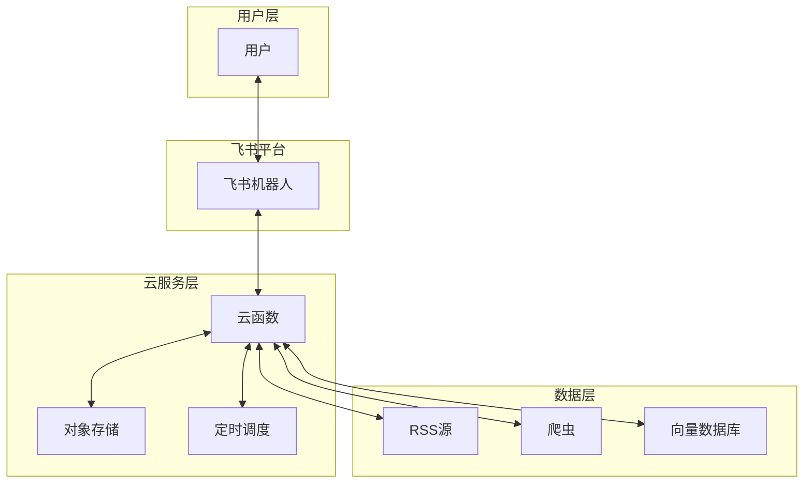

# 需求规格文档（Spec）

## 1. 基本信息

| 字段 | 内容 |
|------|------|
| 需求名称 | 我要做一个资讯订阅工具，目标用户是有资讯订阅需求的用户，比如新能源需求。订阅完资讯主题后，AI自动设 |
| 需求编号 | REQ-264942 |
| 需求类型 | ☑ 功能开发 |
| 提出人 | 用户 |
| 提出日期 | 2026-03-21 |
| 需求优先级 | ☐ P0（紧急） ☑ P1（高） ☐ P2（中） ☐ P3（低） |
| 目标版本 | V1.0 |

---

## 2. 设计目标（Expected State）

### 2.1 能力维度与目标

| 能力维度 | 当前状态 | 期望状态 |
|----------|----------|----------|
| 资讯获取 | 人工搜索 | 自动抓取+AI筛选 |
| 信息处理 | 手动筛选 | AI观点提炼 |
| 推送方式 | 无 | 飞书每日早8点推送 |

### 2.2 期望状态描述

实现一个AI资讯订阅工具，自动跟踪新能源领域的资讯，每日早8点通过飞书向用户推送包含观点提炼的每日总结和洞察。

---

## 3. 业务现状分析（Current Space）

### 3.1 当前实现方式

| 项目 | 说明 |
|------|------|
| 现有流程 | 人工搜索、筛选资讯，耗时且效率低 |
| 技术实现 | 手动浏览网站 |
| 用户交互 | 被动等待信息 |

### 3.2 关键优点

| 优点 | 说明 |
|------|------|
| 人工判断准确 | 用户自行判断资讯相关性 |
| 灵活性高 | 可随时调整搜索策略 |

### 3.3 关键不足

| 不足 | 影响 | 严重程度 |
|------|------|----------|
| 信息筛选耗时 | 每天需要花费大量时间 | P1 |
| 容易遗漏重要资讯 | 人工监控难免有疏漏 | P2 |
| 缺乏洞察提炼 | 仅有列表，没有分析 | P2 |

---

## 4. 目标维度分析

### 4.1 消除原方案的缺陷/不足

| 缺陷 | 解决方案 |
|------|----------|
| 信息筛选耗时 | AI自动抓取+智能筛选 |
| 容易遗漏重要资讯 | 设定关键词监控，自动提醒 |
| 缺乏洞察提炼 | LLM生成观点提炼和总结 |

### 4.2 保持原方案的优点

| 优点 | 如何保持 |
|------|----------|
| 人工判断准确 | 提供用户反馈机制，持续优化 |
| 灵活性高 | 支持用户自定义订阅源和关键词 |

### 4.3 不增加系统复杂性

利用现有开源工具和云服务，避免过度设计。

### 4.4 不引入新的缺点/危害

风险：依赖第三方API服务
应对：选择稳定的云服务商，设置降级策略

---

## 5. 方案设计（Solution Design）

### 5.1 理想度评估

#### 方案A（推荐方案）

| 评估维度 | 评分（1-10） | 说明 |
|----------|--------------|------|
| 功能完整性 | 8 | 覆盖订阅、抓取、推送全流程 |
| 技术可行性 | 9 | 采用成熟技术栈 |
| 性能效率 | 8 | 云函数按需执行 |
| 可维护性 | 8 | 模块化设计，易于维护 |
| 安全性 | 8 | 飞书官方API，安全性高 |
| 成本效益 | 9 | 按使用量付费，成本可控 |
| 用户体验 | 8 | 每日定时推送，开箱即用 |
| **总分** | **58** | |

### 5.2 系统架构图

### 5.3 核心服务模块

| 服务名称 | 职责 | 技术栈 |
|----------|------|--------|
| 订阅管理服务 | 管理用户的订阅主题 | Node.js/FastAPI |
| 资讯采集服务 | 抓取RSS和网站内容 | Python爬虫 |
| AI处理服务 | 内容去重、分类、观点提炼 | LLM API |
| 推送服务 | 定时推送飞书消息 | 飞书Webhook |
| 调度服务 | 管理每日定时任务 | 云调度服务 |

### 5.4 用户故事设计

| 故事ID | 标题 | 角色 | 场景 | 目标 |
|--------|------|------|------|------|
| US-001 | 订阅资讯主题 | 团队成员 | 想关注新能源动态 | 设定关键词，系统自动推送 |
| US-002 | 接收每日摘要 | 团队成员 | 每天早上 | 收到飞书推送，了解今日资讯 |
| US-003 | 管理订阅源 | 管理员 | 需要调整来源 | 添加/删除RSS源 |

---

## 6. 非功能性需求

### 6.1 性能要求

| 指标 | 要求 |
|------|------|
| 响应时间 | 消息推送在30秒内完成 |
| 并发能力 | 支持100个用户同时使用 |

### 6.2 安全要求

| 要求项 | 说明 |
|--------|------|
| 认证授权 | 飞书机器人需企业认证 |
| 数据安全 | 用户数据加密存储 |

---

## 7. 接口设计

| 接口名称 | 类型 | 说明 |
|----------|------|------|
| /subscribe | POST | 订阅主题 |
| /unsubscribe | POST | 取消订阅 |
| /getSubscriptions | GET | 获取订阅列表 |
| /webhook/feishu | POST | 飞书回调 |

---

## 8. 数据需求

### 8.1 数据模型

| 表/集合名 | 用途 | 主要字段 |
|-----------|------|----------|
| subscriptions | 订阅配置 | userId, keywords, sources |
| articles | 资讯存储 | url, title, content, timestamp |
| summaries | 摘要记录 | date, summary, insights |

---

## 9. 依赖分析

| 依赖项 | 版本要求 | 备注 |
|--------|----------|------|
| 飞书API | v3 | 消息推送 |
| LLM API | - | 观点提炼 |
| RSS解析库 | - | 资讯采集 |
| 云函数 | - | 部署环境 |

---

## 10. 附录

### 10.1 术语表

| 术语 | 定义 |
|------|------|
| RSS | 简易信息聚合，用于资讯订阅 |
| Webhook | 回调机制，用于飞书推送 |
| LLM | 大语言模型，用于内容分析 |

### 10.2 变更记录

| 版本 | 日期 | 修改内容 |
|------|------|----------|
| 1.0 | 2026-03-21 | 初始版本 |
