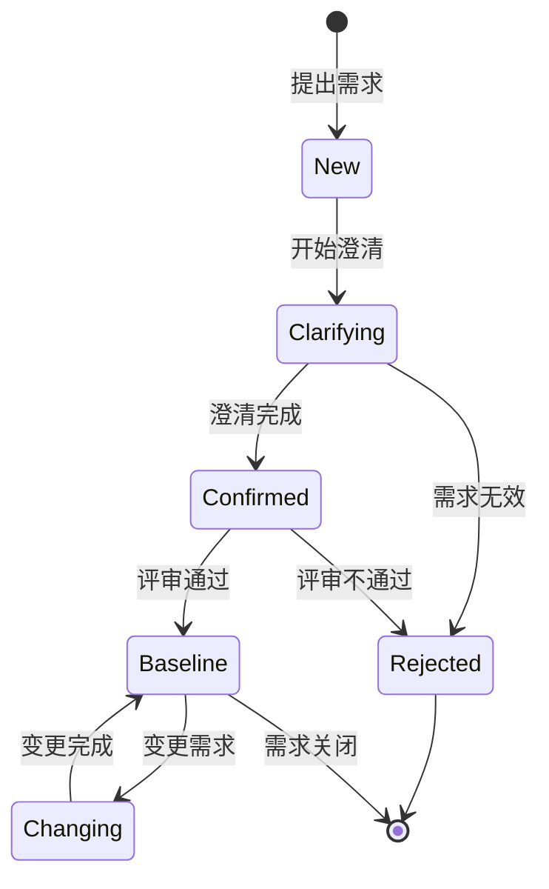

# Requirement Convergence Skill（需求收敛技能）

帮助用户澄清模糊需求、记录结构化需求、进行层级分解。

## 触发条件

### ✅ 应该触发
- 用户说"我有个想法"/"我想做个 xxx"
- 用户需求模糊不清
- 用户说"帮我理一下需求"/"需求怎么拆"
- 用户讨论功能但没想清楚细节
- 用户说"这个需求有点复杂"
- 用户需求已初步清晰，需要完整性评估
- 需要识别需求间的依赖关系和影响范围
- 需要验证需求质量和可测试性
- 需要参考行业最佳实践和合规标准

### ❌ 不应触发
- 用户明确要求开发/写代码
- 用户已有清晰的需求文档
- 用户直接说"帮我实现 xxx"

## 核心能力

### 1. 启发式引导
- 提问帮助用户澄清需求
- 提供思考框架和建议
- 帮助用户发现不清晰的方面

### 2. 需求记录
- 对话中自动记录要点
- 结构化整理用户描述
- 生成需求文档草稿
- **实时记录 JSONL 对话日志**

### 3. 层级分解
- 将复杂需求分解为三层
- 参考华为服务微模型层级
- 底层：可执行的应用/功能点
- **在规格文档中嵌入分层拆解摘要和双向链接**

### 4. 智能需求洞察（新增）
- **完整性评估**：基于 5W2H 七维度自动评分
- **风险预警**：检测模糊词汇、逻辑冲突、资源冲突
- **依赖发现**：自动识别外部系统、数据源、前置/后置条件
- **智能推荐**：基于相似度匹配历史需求和最佳实践

### 5. 动态需求图谱（新增）
- **关系发现**：自动识别需求间的依赖、冲突、引用关系
- **影响分析**：评估需求变更的影响范围和传播路径
- **版本对比**：追踪需求演进历史，生成变更报告
- **复用发现**：识别可复用的需求模式和跨项目复用机会

### 6. 需求验证（新增）
- **可测试性检查**：评估需求是否可测试，提供改进建议
- **验收标准生成**：自动生成 Given-When-Then 格式的验收标准
- **追溯链管理**：建立需求与测试的双向追溯关系
- **质量评分**：综合评估需求质量（完整性、一致性、可测试性、可追溯性）

### 7. 行业模板库（新增）
- **行业模板**：提供电商、金融、医疗等行业的标准需求模板
- **合规检查**：自动检查需求是否符合行业合规标准
- **最佳实践**：提供分场景、分层级的最佳实践建议
- **反模式检测**：识别常见需求陷阱并提供解决方案

### 8. 人格化交互（新增）
- **角色切换**：分析师/引导者/质疑者/协调者四种交互角色
- **上下文记忆**：记录用户偏好、历史决策、项目术语
- **主动提醒**：待澄清事项、评审节点、变更影响提醒
- **学习进化**：基于历史反馈持续优化交互策略

### 9. 检索增强（新增）
- **需求澄清后自动触发检索**
- 检索外部最佳实践（web_search）
- 检索内部历史需求
- 在对话中输出参考建议

### 10. 飞书文档同步（新增）
- **需求定稿后自动创建飞书文档**
- 添加用户为协作者（full_access）
- 更新本地文档记录飞书链接
- 推送消息给用户

## 输出目录

需求存储在 `{workspace}/requirements/` 目录：

```
requirements/
├── communications/          # 对话记录（按日期）
│   └── YYYY-MM/
│       └── REQ-XXXX-NNN/
│           └── transcript.jsonl    # 原始对话日志
├── breakdown/               # 层级分解
│   ├── L1-ValueStream-*.md
│   ├── L2-Scene/
│   └── L3-Activity/
├── specifications/          # 最终需求规格（嵌入分层链接 + 飞书文档 URL）
├── decisions/               # 决策记录
├── research/                # 方案调研（检索能力输出）
├── insights/                # 智能洞察分析结果
│   ├── completeness/        # 完整性评估报告
│   ├── risks/               # 风险预警报告
│   └── dependencies/        # 依赖发现报告
├── knowledge-graph/         # 需求图谱数据
│   ├── graphs/              # 图谱快照
│   ├── impact-analysis/     # 影响分析报告
│   ├── version-history/     # 版本对比报告
│   └── reuse-discovery/     # 复用发现报告
├── validation/              # 需求验证结果
│   ├── testability/         # 可测试性检查报告
│   ├── acceptance-criteria/ # 验收标准
│   ├── traceability/        # 追溯链矩阵
│   └── quality-scores/      # 质量评分报告
├── templates/               # 行业模板库
│   ├── industry/            # 行业模板
│   ├── compliance/          # 合规检查结果
│   └── best-practices/      # 最佳实践参考
├── persona/                 # 人格化交互数据
│   ├── user-profiles/       # 用户画像
│   ├── memories/            # 上下文记忆
│   └── learning/            # 学习记录
├── .meta.json               # ID 序号追踪
├── .feishu-index.json       # 飞书文档索引
└── .template.zh.md          # 中文模板
```

## ID 分配规则

```javascript
// 从 .meta.json 读取 nextId
// 生成 REQ-YYYY-NNN
// 例如：REQ-2026-001
// 分配后 nextId++
```

## 启发式提问框架（5W2H）

### Who - 用户
- 这个功能是给谁用的？
- 主要用户角色有哪些？
- 谁决定需求？谁验收？

### What - 解决什么问题
- 用户目前怎么解决这个问题？
- 核心痛点是什么？
- 不解决会怎样？

### Why - 为什么做
- 业务目标是什么？
- 如何衡量成功？
- ROI 值得吗？

### When - 时间约束
- 预期上线时间？
- 有无里程碑节点？
- 外部依赖时间？

### Where - 使用场景
- 在什么场景下使用？
- 有无特殊环境要求？
- 需要多平台支持吗？

### How - 实现方式
- 有无技术偏好或约束？
- 有无参考产品？
- 自研还是外包？

### How Much - 规模约束
- 预算范围？
- 预期用户规模？
- 数据量级？

## 优先级机制（MoSCoW）

| 级别 | 含义 | 判断标准 |
|------|------|----------|
| **Must** | 必须有 | 没有就不能上线 / 核心价值依赖它 |
| **Should** | 应该有 | 重要但可迭代 / 明显体验提升 |
| **Could** | 可以有 | 锦上添花 / 有资源再做 |
| **Won't** | 不做 | 明确排除 / 放入 backlog |

## 状态流转



## 层级系统（华为服务模型）

### L1: 价值流
- 端到端价值创造过程
- 示例：从"DSL 系统描述"到"可用功能上线"
- 价值流 = 所有场景业务流程的集合

### L2: 场景 + 业务流程
- 场景作为条件，每个场景对应一个业务流程
- 业务流程 = 多个业务活动链式连接（A→B→C→D）
- 示例：从"模糊需求"到"可执行任务列表"

### L3: 业务活动（由 Skill 承载）
- 最小粒度，描述为"从 A 到 B"
- 每个业务活动由一个 Skill 承载
- 示例：从"需求描述"到"需求结构化"

## 检索能力（新增）

### 触发条件

**显式触发**：
- 用户说"需求差不多了" / "大概就是这样" / "先这样吧"
- 用户说"帮我查查有没有更好的方案"
- 用户主动询问"业界是怎么做的"

**隐式触发**：
- Agent 判断需求已覆盖核心场景
- 需求规格已初步成型
- 连续 3 轮对话无新增核心需求

**不触发的情况**：
- 需求仍在早期探索阶段
- 用户明确表示"先不急着查"
- 简单需求无需参考（如配置修改）

### 检索内容

**外部检索** (`web_search`)：
- 竞品分析
- 行业最佳实践
- 技术解决方案

**内部检索** (本地 `requirements/` 目录)：
- 历史类似需求
- 已实现的功能方案

### 输出模板

```markdown
基于您描述的需求，我检索了一些参考方案供您参考：

## 🌐 业界最佳实践

### 竞品方案
1. **XXX 产品** - [链接](https://...)
   - 核心做法：...
   - 可借鉴点：...

2. **YYY 方案** - [链接](https://...)
   - 核心做法：...
   - 可借鉴点：...

### 行业趋势
- 领先方案通常包含 A、B、C 三个模块
- 近期趋势是...

## 📁 内部历史参考

### 类似需求
- **REQ-2026-001** - AI 资讯检索工具
  - 相似点：...
  - 可复用：...

## 💡 建议

基于以上参考，您可以考虑：
1. 是否需要补充 XXX 功能？
2. YYY 细节是否需要明确？
3. 是否参考 ZZZ 的做法？

供您参考，是否需要补充或调整？
```

## 飞书文档同步（新增）

### 触发时机
- 需求状态变更为 `Baseline`
- 用户确认需求定稿

### SOP - 飞书文档创建并添加协作者

```
1. feishu_doc.create(title) → 获取 doc_token
       ↓
2. feishu_doc.write(doc_token, content) → 写入内容
       ↓
3. 获取 tenant_access_token → 调用飞书 API
       ↓
4. 添加协作者 API → 刁老师 (unionid)
       ↓
5. 验证权限 → 完成
```

### 认证信息
- app_id: `cli_a8130f231a6ad013`
- app_secret: `wD2D8Yqbs1Ajq8wy4IbEnfkrjCGY6xhh`
- tenant_access_token 有效期：约 2 小时

### 添加协作者 API
```bash
POST https://open.feishu.cn/open-apis/drive/v1/permissions/{doc_token}/members?need_notification=false&type=docx
Authorization: Bearer {tenant_access_token}
{
  "member_id": "on_e925f80257e0607392953f567ca7565d",
  "member_type": "unionid",
  "perm": "full_access",
  "perm_type": "container",
  "type": "user"
}
```

### 关键要点
- `feishu_doc.create` 的 content 参数不生效 - 必须用 create→write 模式
- 必须使用 unionid（不能用 openid）
- 刁老师 unionid：`on_e925f80257e0607392953f567ca7565d`
- 权限级别：`full_access`（可管理）

### 本地文档更新
在需求文档 Frontmatter 中增加：
```markdown
---
feishu_doc_url: https://feishu.cn/docx/xxx
feishu_doc_token: DOXCNSxxxxxxxx
feishu_synced_at: 2026-03-16T14:30:00+08:00
---
```

在需求文档正文中增加表格：
```markdown
| 属性 | 值 |
|------|-----|
| 飞书文档 | [查看](https://feishu.cn/docx/xxx) |
| 最后同步 | 2026-03-16 14:30 |
```

### .feishu-index.json 格式
```json
{
  "REQ-2026-001": {
    "doc_token": "DOXCNSxxxxxxxx",
    "doc_url": "https://feishu.cn/docx/xxx",
    "created_at": "2026-03-16T08:38:00+08:00",
    "synced_at": "2026-03-16T14:30:00+08:00",
    "status": "baseline",
    "local_path": "specifications/REQ-2026-001-AI-News-Retrieval.md"
  }
}
```

## 对话记录 JSONL（新增）

### 目录结构
```
communications/
└── YYYY-MM/
    └── REQ-XXXX-NNN/
        └── transcript.jsonl    # 原始对话日志（唯一记录）
```

### 文件格式
```jsonl
{"timestamp": "2026-03-16T08:15:23+08:00", "role": "user", "message_id": "om_xxx", "content": "用户原始消息"}
{"timestamp": "2026-03-16T08:15:45+08:00", "role": "agent", "message_id": "om_yyy", "content": "Agent 原始回复"}
```

### 记录时机
- 需求沟通过程中，每条消息实时追加
- 包含完整原始内容（不截断、不摘要）
- 记录 message_id 用于追溯

### 不记录的内容
- ❌ 结构化摘要（事后分析时才产生）
- ❌ 关键决策记录（事后分析时才产生）
- ❌ Agent 内部思考过程

## 分层拆解嵌入（新增）

在最终需求规格文档中嵌入分层拆解摘要和双向链接：

```markdown
## 需求分层拆解

### L1 价值流
- **名称**：XXX 价值流
- **定义**：从「A」到「B」
- **文档**：[breakdown/L1-ValueStream-XXX.md](../breakdown/L1-ValueStream-XXX.md)

### L2 场景
| 场景 | 业务流程 | 文档 |
|------|----------|------|
| XXX | A→B→C | [L2-Scene/XXX.md](../breakdown/L2-Scene/XXX.md) |

### L3 业务活动
| 序号 | 活动 | 定义 | 承载方式 | 文档 |
|------|------|------|----------|------|
| 1 | XXX | A→B | 工具/技能 | [L3-Activity/Activity-List.md](../breakdown/L3-Activity/Activity-List.md) |
```

## 新增 API 调用示例

### 智能需求洞察 API

```typescript
import { analyzeRequirement } from './ai-engine/insight-engine';

const requirement = '需要一个快速、友好的用户注册系统，支持微信登录';
const insightResult = analyzeRequirement(requirement);

console.log('完整性评分:', insightResult.completeness.score.totalScore);
console.log('风险等级:', insightResult.riskWarning.overallRiskLevel);
console.log('依赖数量:', insightResult.dependencies.dependencies.length);
console.log('推荐数量:', insightResult.recommendations.recommendations.length);
```

### 需求图谱 API

```typescript
import {
  createRequirementNode,
  buildGraphWithRelationships,
  analyzeRequirementImpact,
  findReusableRequirements
} from './knowledge-graph';

// 创建需求节点
const reqNode = createRequirementNode(
  '用户管理系统',
  '提供完整的用户管理功能',
  'FUNCTIONAL',
  1,
  { status: 'APPROVED', priority: 'HIGH' }
);

// 构建图谱
const graph = buildGraphWithRelationships([reqNode, ...], {
  dependencyThreshold: 0.6,
  detectConflicts: true
});

// 影响分析
const impactResult = analyzeRequirementImpact(reqNode.id, graph);
console.log(impactResult.report);

// 复用发现
const reuseRecommendations = findReusableRequirements(targetReq, allReqs, {
  minSimilarityThreshold: 0.6,
  maxRecommendations: 5
});
```

### 需求验证 API

```typescript
import {
  TestabilityChecker,
  AcceptanceCriteriaGenerator,
  TraceabilityManager,
  QualityScorer
} from './validation-engine';

// 可测试性检查
const testabilityChecker = createTestabilityChecker();
const testabilityReport = testabilityChecker.generateReport(
  '用户需要快速登录系统，响应时间应该在 2 秒内'
);
console.log(`可测试性评分：${testabilityReport.overallScore}`);

// 验收标准生成
const acGenerator = createAcceptanceCriteriaGenerator();
const criteriaSet = acGenerator.generate(
  'REQ-001',
  '用户需要快速登录系统，响应时间应该在 2 秒内'
);
console.log(`生成了${criteriaSet.totalScenarios}个验收场景`);

// 质量评分
const qualityScorer = createQualityScorer();
const qualityReport = qualityScorer.score(
  'REQ-001',
  '用户需要快速登录系统，响应时间应该在 2 秒内'
);
console.log(`综合质量评分：${qualityReport.overallScore} (${qualityReport.qualityGrade})`);
```

### 行业模板库 API

```typescript
import {
  getTemplate,
  ComplianceChecker,
  BestPracticeLibrary,
  AntiPatternDetector
} from './template-library';

// 获取行业模板
const template = getTemplate('ecommerce', 'user-registration');

// 合规检查
const complianceChecker = createComplianceChecker();
const complianceReport = complianceChecker.check(
  requirement,
  ['GDPR', 'PIPL']
);
console.log(`合规通过率：${complianceReport.passRate}%`);

// 最佳实践推荐
const practiceLibrary = createBestPracticeLibrary();
const practices = practiceLibrary.getPracticesByScenario('user-authentication');

// 反模式检测
const detector = createAntiPatternDetector();
const detectedPatterns = detector.detect(requirement);
```

### 人格化交互 API

```typescript
import { PersonaEngine } from './persona-engine';

// 初始化引擎
const personaEngine = PersonaEngine.getInstance();
personaEngine.initialize('user-123', {
  enableNotifications: true,
  enableLearning: true
});

// 切换角色
personaEngine.personaManager.switchPersona('analyst');

// 记录用户偏好
personaEngine.contextMemory.addPreference({
  category: 'communication',
  preference: '详细解释',
  confidence: 0.9
});

// 添加提醒
personaEngine.proactiveNotifier.addReminder({
  type: 'clarification_needed',
  title: '待澄清事项',
  description: '需求缺少成本预算信息',
  priority: 'high'
});

// 学习反馈
personaEngine.learningEngine.recordFeedback({
  interactionId: 'int-001',
  feedbackType: 'positive',
  rating: 5
});
```

## 重要边界

### ⛔ 绝对不做
- **不做功能开发**
- 不写代码
- 不做技术实现方案
- 不调用开发相关工具
- 不代替用户做决策
- 不提供未经用户确认的假设

### ✅ 只做
- 需求讨论和澄清
- 需求记录和整理
- 需求分解和分层
- 启发式提问和建议
- 检索业界最佳实践（需求澄清后）
- 飞书文档同步（需求定稿后）
- 智能需求洞察分析（完整性、风险、依赖、推荐）
- 构建需求图谱并分析影响范围
- 验证需求质量和可测试性
- 提供行业模板和合规检查
- 人格化交互和主动提醒
- 基于历史数据学习优化

## 参考文档

- [requirement-template.md](references/requirement-template.md) - 需求记录模板
- [huawei-service-model.md](references/huawei-service-model.md) - 华为服务微模型
- [insight-engine.md](references/insight-engine.md) - 智能需求洞察引擎使用指南
- [knowledge-graph.md](references/knowledge-graph.md) - 需求图谱构建与分析
- [validation-engine.md](references/validation-engine.md) - 需求验证与质量评分
- [template-library.md](references/template-library.md) - 行业模板与最佳实践
- [persona-engine.md](references/persona-engine.md) - 人格化交互配置指南

---

*此技能专注于需求收敛。开发实现请使用其他技能。*
