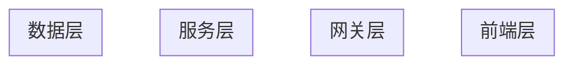

# 需求规格文档（Spec）

## 1. 基本信息

| 字段 | 内容 |
|------|------|
| 需求名称 | |
| 需求编号 | |
| 需求类型 | ☐ 功能开发  ☐ Agent开发  ☐ 优化重构  ☐ 技术研究 |
| 提出人 | |
| 提出日期 | |
| 需求优先级 | ☐ P0（紧急） ☐ P1（高） ☐ P2（中） ☐ P3（低） |
| 目标版本 | |

---

## 2. 设计目标（Expected State）

### 2.1 能力维度与目标

| 能力维度 | 当前状态 | 期望状态 |
|----------|----------|----------|
|  |  |  |
|  |  |  |

### 2.2 期望状态描述

> 描述需求实现后，系统/用户/业务达到的理想状态。不关心**如何实现**，聚焦于**达成什么效果**。

---

## 3. 业务现状分析（Current State）

### 3.1 当前实现方式

| 项目 | 说明 |
|------|------|
| 现有流程 | |
| 技术实现 | |
| 用户交互 | |

### 3.2 关键优点

| 优点 | 说明 |
|------|------|
|  |  |

### 3.3 关键不足

| 不足 | 影响 | 严重程度 |
|------|------|----------|
|  |  |  |

---

## 4. 目标维度分析

### 4.1 消除原方案的缺陷/不足

| 缺陷 | 解决方案 |
|------|----------|
|  |  |

### 4.2 保持原方案的优点

| 优点 | 如何保持 |
|------|----------|
|  |  |

### 4.3 不增加系统复杂性

> 说明如何利用已有资源。

### 4.4 不引入新的缺点/危害

> 分析潜在风险及应对措施。

---

## 5. 方案设计（Solution Design）

### 5.1 理想度评估

#### 方案A（推荐方案）

| 评估维度 | 评分（1-10） | 说明 |
|----------|--------------|------|
| 功能完整性 | | |
| 技术可行性 | | |
| 性能效率 | | |
| 可维护性 | | |
| 安全性 | | |
| 成本效益 | | |
| 用户体验 | | |
| **总分** | | |

### 5.2 系统架构图

### 5.3 核心服务模块

| 服务名称 | 职责 | 技术栈 |
|----------|------|--------|
|  |  |  |

### 5.4 用户故事设计

| 故事ID | 标题 | 角色 | 场景 | 目标 |
|--------|------|------|------|------|
| US-001 | | | | |

---

## 6. 非功能性需求

### 6.1 性能要求

| 指标 | 要求 |
|------|------|
| 响应时间 | |
| 并发能力 | |

### 6.2 安全要求

| 要求项 | 说明 |
|--------|------|
| 认证授权 | |
| 数据安全 | |

---

## 7. 接口设计

| 接口名称 | 类型 | 说明 |
|----------|------|------|
|  |  |  |

---

## 8. 数据需求

### 8.1 数据模型

| 表/集合名 | 用途 | 主要字段 |
|-----------|------|----------|
|  |  |  |

---

## 9. 依赖分析

| 依赖项 | 版本要求 | 备注 |
|--------|----------|------|
|  |  |  |

---

## 10. 附录

### 10.1 术语表

| 术语 | 定义 |
|------|------|
|  |  |

### 10.2 变更记录

| 版本 | 日期 | 修改内容 |
|------|------|----------|
|  |  |  |