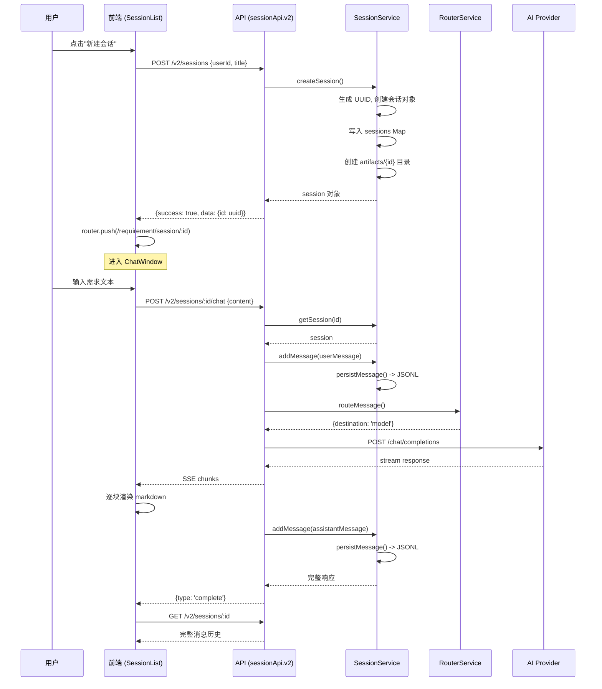

# 会话服务架构文档

> 文档版本：1.0.0
> 生成时间：2026-03-21
> 相关会话：`a6a8b926-819b-4f9d-860f-76aecfd5099a`

***

## 一、架构概览

### 1.1 系统上下文

```
┌─────────────────────────────────────────────────────────────────────────────┐
│                              前端层 (Vue 3)                                 │
│  ┌──────────────────┐    ┌──────────────────┐    ┌──────────────────┐     │
│  │  SessionList.vue │    │  ChatWindow.vue  │    │  user.js store   │     │
│  │  会话列表页面     │    │  聊天窗口页面     │    │  状态管理        │     │
│  └────────┬─────────┘    └────────┬─────────┘    └────────┬─────────┘     │
└───────────┼───────────────────────┼───────────────────────┼───────────────┘
            │                       │                       │
            ▼                       ▼                       ▼
┌─────────────────────────────────────────────────────────────────────────────┐
│                           API 层 (session.js)                               │
│  ┌──────────────────────────────────────────────────────────────────────┐  │
│  │  sessionApi.v2.create() / .list() / .getById() / .chat()           │  │
│  └──────────────────────────────────────────────────────────────────────┘  │
└─────────────────────────────────────────────────────────────────────────────┘
            │                       │                       │
            ▼                       ▼                       ▼
┌─────────────────────────────────────────────────────────────────────────────┐
│                          后端路由层 (Express)                                │
│  ┌────────────────────┐                         ┌────────────────────┐      │
│  │  routes/session.js │                         │  routes/v2.js      │      │
│  │  (数据库持久化)     │                         │  (会话服务+AI)      │      │
│  └────────┬───────────┘                         └────────┬───────────┘      │
│           │                                             │                   │
│           ▼                                             ▼                   │
│  ┌──────────────────────────────────────────────────────────────────────┐  │
│  │                     核心服务层 (core/)                               │  │
│  │  ┌─────────────┐  ┌─────────────┐  ┌─────────────┐  ┌─────────────┐ │  │
│  │  │SessionService│  │AgentService │  │RouterService│  │PromptBuilder│ │  │
│  │  │会话管理      │  │Agent配置    │  │AI路由      │  │Prompt构建   │ │  │
│  │  └─────────────┘  └─────────────┘  └─────────────┘  └─────────────┘ │  │
│  └──────────────────────────────────────────────────────────────────────┘  │
│                               │                                              │
│                               ▼                                              │
│  ┌──────────────────────────────────────────────────────────────────────┐  │
│  │                    增强服务层 (enhancedSkillService.js)               │  │
│  │  ┌────────────────────────────────────────────────────────────────┐  │  │
│  │  │  EnhancedSkillService                                           │  │  │
│  │  │  ├── 意图识别 (intentRecognizer.js)                             │  │  │
│  │  │  ├── 需求收敛 (requirement-convergence/)                        │  │  │
│  │  │  └── AI API 调用 (流式响应)                                     │  │  │
│  │  └────────────────────────────────────────────────────────────────┘  │  │
│  └──────────────────────────────────────────────────────────────────────┘  │
└─────────────────────────────────────────────────────────────────────────────┘
            │
            ▼
┌─────────────────────────────────────────────────────────────────────────────┐
│                              数据层                                          │
│  ┌─────────────────────────────┐      ┌─────────────────────────────────┐ │
│  │  MySQL 数据库               │      │  文件系统 (JSONL)               │ │
│  │  sessions / messages 表    │      │  agents/{agentId}/sessions/     │ │
│  └─────────────────────────────┘      └─────────────────────────────────┘ │
└─────────────────────────────────────────────────────────────────────────────┘
```

### 1.2 核心组件

| 组件                       | 文件路径                                      | 职责                         |
| ------------------------ | ----------------------------------------- | -------------------------- |
| **SessionService**       | `server/services/core/SessionService.js`  | 会话生命周期管理、JSONL 持久化         |
| **AgentService**         | `server/services/core/AgentService.js`    | Agent 配置加载与管理              |
| **RouterService**        | `server/services/core/RouterService.js`   | AI 请求路由与 Provider 选择       |
| **EnhancedSkillService** | `server/services/enhancedSkillService.js` | 意图识别、需求分析、AI 流式响应          |
| **IntentRecognizer**     | `server/services/intentRecognizer.js`     | QA/REQUIREMENT/CHAT 三种意图识别 |

***

## 二、数据流架构

### 2.1 完整消息流程

```
┌─────────────────────────────────────────────────────────────────────────────┐
│                              用户发送消息                                     │
│  输入: "我要做一个资讯订阅系统"                                               │
└─────────────────────────────────────────────────────────────────────────────┘
                                    │
                                    ▼
┌─────────────────────────────────────────────────────────────────────────────┐
│                        1. 前端处理 (ChatWindow.vue)                          │
│  ┌──────────────────────────────────────────────────────────────────────┐  │
│  │  1. inputMessage.value = ''                                          │  │
│  │  2. isStreaming.value = true                                        │  │
│  │  3. 调用 sessionApi.v2.chat(sessionId, content)                      │  │
│  │  4. 建立 SSE 连接，接收流式响应                                       │  │
│  │  5. 实时渲染 markdown 内容                                            │  │
│  │  6. 流结束后调用 fetchMessages() 刷新完整消息列表                      │  │
│  └──────────────────────────────────────────────────────────────────────┘  │
└─────────────────────────────────────────────────────────────────────────────┘
                                    │
                                    ▼ HTTP POST /api/v2/sessions/:id/chat
┌─────────────────────────────────────────────────────────────────────────────┐
│                        2. 后端路由 (routes/v2.js)                           │
│  ┌──────────────────────────────────────────────────────────────────────┐  │
│  │  POST /sessions/:id/chat 处理器:                                      │  │
│  │  1. 获取 session                                                     │  │
│  │  2. 验证会话存在                                                      │  │
│  │  3. 保存用户消息 (sessionService.addMessage)                          │  │
│  │  4. 路由判断: skill vs model                                         │  │
│  │  5. 构建 Prompt                                                      │  │
│  │  6. 调用 AI API (RouterService)                                      │  │
│  │  7. SSE 流式返回响应                                                  │  │
│  │  8. 保存 AI 回复到会话                                                │  │
│  └──────────────────────────────────────────────────────────────────────┘  │
└─────────────────────────────────────────────────────────────────────────────┘
                                    │
                                    ▼
┌─────────────────────────────────────────────────────────────────────────────┐
│                    3.1 意图识别 (enhancedSkillService)                       │
│  ┌──────────────────────────────────────────────────────────────────────┐  │
│  │  recognizeIntent() 分析用户输入:                                       │  │
│  │  - QA 模式: "什么是..."、"如何..."                                    │  │
│  │  - REQUIREMENT 模式: "我要做..."、"我想实现..."                        │  │
│  │  - CHAT 模式: 默认闲聊                                               │  │
│  └──────────────────────────────────────────────────────────────────────┘  │
└─────────────────────────────────────────────────────────────────────────────┘
                                    │
                                    ▼
┌─────────────────────────────────────────────────────────────────────────────┐
│                    3.2 需求分析 (RequirementService)                        │
│  ┌──────────────────────────────────────────────────────────────────────┐  │
│  │  RequirementService.analyze():                                        │  │
│  │  ├── 5W2H 七维度评分 (Who/What/Why/When/Where/How/HowMuch)          │  │
│  │  ├── 风险预警 (模糊表述、范围不清)                                     │  │
│  │  ├── 依赖发现 (外部系统、数据源、前置条件)                              │  │
│  │  ├── 行业领域检测 (电商/金融/企业/AI等)                                │  │
│  │  ├── 智能推荐 (技术栈、最佳实践)                                       │  │
│  │  └── 自适应提问 (引导用户补充缺失维度)                                  │  │
│  └──────────────────────────────────────────────────────────────────────┘  │
└─────────────────────────────────────────────────────────────────────────────┘
                                    │
                                    ▼
┌─────────────────────────────────────────────────────────────────────────────┐
│                    3.3 流式响应 (SSE)                                       │
│  ┌──────────────────────────────────────────────────────────────────────┐  │
│  │  streamResponse() 生成器:                                            │  │
│  │  yield { type: 'chunk', content: '...' }  // 逐字符/分段             │  │
│  │  yield { type: 'complete', metadata: {...} }  // 完成标记             │  │
│  │                                                                      │  │
│  │  前端接收格式:                                                        │  │
│  │  data: {"type":"chunk","content":"第一段"}\n\n                        │  │
│  │  data: {"type":"chunk","content":"第二段"}\n\n                        │  │
│  │  data: {"type":"complete","metadata":{...}}\n\n                       │  │
│  └──────────────────────────────────────────────────────────────────────┘  │
└─────────────────────────────────────────────────────────────────────────────┘
                                    │
                                    ▼
┌─────────────────────────────────────────────────────────────────────────────┐
│                        4. 会话持久化 (SessionService)                        │
│  ┌──────────────────────────────────────────────────────────────────────┐  │
│  │  JSONL 文件格式:                                                      │  │
│  │  {"id":"...","sessionId":"...","role":"user","content":{...},...}\n  │  │
│  │  {"id":"...","sessionId":"...","role":"assistant","content":{...},...}\n│  │
│  │                                                                      │  │
│  │  存储路径: agents/{agentId}/sessions/{sessionId}.jsonl             │  │
│  └──────────────────────────────────────────────────────────────────────┘  │
└─────────────────────────────────────────────────────────────────────────────┘
```

### 2.2 双模式持久化

系统同时使用 MySQL 数据库和 JSONL 文件存储会话数据：

| 存储方式      | 表/文件                                   | 用途                | 优势              |
| --------- | -------------------------------------- | ----------------- | --------------- |
| **MySQL** | `sessions`, `messages`                 | 基础 CRUD、用户隔离、分页查询 | 结构化、事务性、易于管理    |
| **JSONL** | `agents/{agentId}/sessions/{id}.jsonl` | 完整消息历史、AI 对话上下文   | 易于读取流式传输、保留原始格式 |

**会话列表查询** (SessionList.vue):

```
1. 调用 GET /api/sessions?userId=xxx
2. 后端从 MySQL sessions 表查询
3. 返回分页结果
```

**聊天消息加载** (ChatWindow\.vue):

```
1. 调用 GET /api/v2/sessions/:id
2. 后端从 SessionService 获取
3. SessionService 先查 Map 缓存
4. 缓存未命中则从 JSONL 文件加载
5. 返回完整消息历史
```

***

## 三、核心服务详解

### 3.1 SessionService

**文件**: `server/services/core/SessionService.js`

**核心职责**: 管理会话生命周期和消息持久化

**核心方法**:

| 方法                                      | 说明           |
| --------------------------------------- | ------------ |
| `createSession(userId, agentId, title)` | 创建新会话        |
| `getSession(sessionId)`                 | 获取会话         |
| `getSessionHistory(sessionId)`          | 获取消息历史       |
| `addMessage(sessionId, message)`        | 添加消息         |
| `deleteSession(sessionId)`              | 删除会话         |
| `getUserSessions(userId)`               | 获取用户的所有会话    |
| `persistMessage(sessionId, message)`    | 持久化消息到 JSONL |

**内存结构**:

```javascript
{
  sessions: Map<sessionId, session>,
  messages: Map<sessionId, message[]>
}
```

**JSONL 持久化格式**:

```jsonl
{"id":"msg-uuid","sessionId":"sess-uuid","role":"user","content":{"type":"text","text":"用户消息"},"createdAt":"2026-03-21T10:00:00.000Z"}
{"id":"msg-uuid","sessionId":"sess-uuid","role":"assistant","content":{"type":"text","text":"AI回复"},"createdAt":"2026-03-21T10:00:01.000Z"}
```

### 3.2 RouterService

**文件**: `server/services/core/RouterService.js`

**核心职责**: AI 请求路由和 Provider 选择

**路由决策**:

```javascript
routeMessage(message, context) {
  // 检查是否触发 Skill
  if (skill.matchCondition(message.content)) {
    return { destination: 'skill', targetId: skill.id }
  }
  // 默认路由到 Model
  return { destination: 'model', targetId: session.modelId }
}
```

**Provider 选择**:

```javascript
routeAPI(request, providerId) {
  // 1. 指定 providerId → 使用该 provider
  // 2. 未指定 → 根据 modelId 选择默认 provider
  // 3. 构建完整请求: endpoint + headers + body
}
```

**Fallback 机制**:

```javascript
executeWithFallback(request, onFallback) {
  for (const provider of fallbackChain) {
    try {
      return await executeRequest(request, provider)
    } catch (error) {
      // 尝试下一个 provider
    }
  }
}
```

### 3.3 EnhancedSkillService

**文件**: `server/services/enhancedSkillService.js`

**核心职责**: 意图识别、需求分析、流式响应

**流式响应处理**:

```javascript
async *streamResponse(userMessage, conversationHistory) {
  // 1. 意图识别
  const intent = recognizeIntent(userMessage)

  // 2. 根据意图分发
  switch (intent.type) {
    case 'QA':
      yield* this.handleQA()
      break
    case 'REQUIREMENT':
      yield* this.handleRequirement()
      break
    case 'CHAT':
      yield* this.handleChat()
      break
  }
}
```

**意图识别模式** (intentRecognizer.js):

| 意图类型            | 匹配模式示例                       | 处理方式           |
| --------------- | ---------------------------- | -------------- |
| **QA**          | "什么是AI"、"如何实现"、"能做什么"        | 直接回答问题         |
| **REQUIREMENT** | "我要做..."、"我想实现..."、"做个...系统" | 5W2H 分析 + 引导提问 |
| **CHAT**        | 默认                           | 友好闲聊 + 引导需求    |

### 3.4 需求分析 (RequirementService)

**内置需求分析逻辑** (当 `requirement-convergence` 模块未加载时):

```javascript
analyze(requirement) {
  return {
    insight: {
      completeness: {
        score: { totalScore: 65, Who: 80, What: 90, ... },
        missingElements: [...]
      }
    },
    risks: { risks: [...], overallRiskLevel: 'medium' },
    dependencies: { dependencies: [...], total: 2 },
    domain: 'ecommerce',
    recommendations: [...],
    questions: [...]
  }
}
```

**5W2H 评分维度**:

| 维度           | 关键词          | 权重 |
| ------------ | ------------ | -- |
| Who (用户)     | 用户、管理员、客户、员工 | 15 |
| What (功能)    | 功能、需求、实现、系统  | 20 |
| Why (目的)     | 目的、价值、目标、痛点  | 15 |
| When (时间)    | 时间、上线、周期、期限  | 10 |
| Where (场景)   | 场景、环境、平台、终端  | 10 |
| How (方式)     | 方式、方法、技术、方案  | 15 |
| HowMuch (规模) | 成本、预算、资源、人力  | 15 |

***

## 四、前端架构

### 4.1 组件结构

```
views/requirement/
├── Layout.vue              # 布局容器
├── SessionList.vue         # 会话列表
│   ├── 新建会话按钮
│   ├── 搜索栏
│   ├── 会话卡片列表
│   └── 编辑/删除会话
└── ChatWindow.vue          # 聊天窗口
    ├── 聊天头部 (返回/标题/编辑)
    ├── 消息列表
    │   ├── 用户消息 (右侧)
    │   └── AI 消息 (左侧, markdown 渲染)
    ├── 流式响应显示
    └── 输入区域
```

### 4.2 ChatWindow\.vue 核心逻辑

**消息发送流程**:

```javascript
async sendMessage() {
  // 1. 清空输入
  inputMessage.value = ''
  isStreaming.value = true

  // 2. 调用 chat API
  const response = await sessionApi.v2.chat(sessionId, content)

  // 3. 建立流式读取
  const reader = response.body.getReader()

  // 4. 逐块处理 SSE 数据
  while (true) {
    const { done, value } = await reader.read()
    if (done) break

    const chunk = decoder.decode(value)
    const lines = chunk.split('\n')

    for (const line of lines) {
      if (line.startsWith('data: ')) {
        const data = JSON.parse(line.slice(6))

        if (data.type === 'chunk') {
          // 追加内容
          streamingContent.value += data.content
          scrollToBottom()
        }

        if (data.type === 'done' || data.type === 'complete') {
          // 流结束，重新获取完整消息
          await fetchMessages()
        }

        if (data.type === 'error') {
          // 错误处理
          errorMsg.value = data.message
        }
      }
    }
  }

  isStreaming.value = false
}
```

**Markdown 渲染**:

```javascript
const md = markdownit({
  highlight: function (str, lang) {
    if (lang && hljs.getLanguage(lang)) {
      return hljs.highlight(str, { language: lang }).value
    }
    return md.utils.escapeHtml(str)
  }
})

const formatContent = (content) => {
  if (typeof content !== 'string') {
    return md.render(content.text || String(content))
  }
  return md.render(content)
}
```

### 4.3 SessionList.vue 核心逻辑

**会话列表加载**:

```javascript
const fetchSessions = async () => {
  const userId = getCurrentUserId()
  const res = await sessionApi.v2.list(userId, { page, pageSize })

  if (res.success) {
    sessions.value = res.data.list
    total.value = res.data.total
  }
}

const createSession = async () => {
  const res = await sessionApi.v2.create(userId, null, '新会话')
  if (res.success) {
    router.push(`/requirement/session/${res.data.id}`)
  }
}
```

***

## 五、API 接口

### 5.1 V2 API (会话服务)

| 接口                           | 方法     | 说明            | 请求体/参数                     |
| ---------------------------- | ------ | ------------- | -------------------------- |
| `/v2/sessions`               | POST   | 创建会话          | `{userId, agentId, title}` |
| `/v2/sessions`               | GET    | 获取会话列表        | `?userId=&page=&pageSize=` |
| `/v2/sessions/:id`           | GET    | 获取会话详情(含消息)   | -                          |
| `/v2/sessions/:id`           | PUT    | 更新会话          | `{title}`                  |
| `/v2/sessions/:id`           | DELETE | 删除会话          | -                          |
| `/v2/sessions/:id/messages`  | POST   | 添加消息          | `{content, role}`          |
| `/v2/sessions/:id/chat`      | POST   | **聊天接口(SSE)** | `{content}`                |
| `/v2/sessions/:id/artifacts` | GET    | 获取会话产物        | -                          |

### 5.2 Chat SSE 响应格式

```javascript
// 逐块内容
data: {"type":"chunk","content":"正在分析您的需求"}\n\n

data: {"type":"chunk","content":"\n\n## 需求完整性评估\n"}\n\n

// 完成标记
data: {"type":"complete","metadata":{"modelId":"gpt-4o-mini","providerId":"openai-primary"}}\n\n


// 错误格式
data: {"type":"error","message":"服务暂时不可用"}\n\n
```

### 5.3 数据库 API (routes/session.js)

| 接口                            | 方法     | 说明          | 权限      |
| ----------------------------- | ------ | ----------- | ------- |
| `/sessions`                   | GET    | 获取会话列表      | 需登录     |
| `/sessions`                   | POST   | 创建会话        | 需登录     |
| `/sessions/:id`               | GET    | 获取会话详情      | 需登录(本人) |
| `/sessions/:id`               | PUT    | 更新会话        | 需登录(本人) |
| `/sessions/:id`               | DELETE | 删除会话        | 需登录(本人) |
| `/sessions/:id/messages`      | GET    | 获取消息列表      | -       |
| `/sessions/:id/messages`      | POST   | 发送消息        | -       |
| `/sessions/:id/messages/chat` | POST   | **聊天(SSE)** | 需登录     |

***

## 六、数据模型

### 6.1 Session 模型

```javascript
{
  id: UUID,                    // 会话ID
  user_id: UUID,              // 用户ID
  title: String(200),         // 会话标题
  status: ENUM,               // active/archived/deleted
  last_message_at: Date,      // 最后消息时间
  metadata: JSON,             // 元数据
  created_at: Date,
  updated_at: Date
}
```

### 6.2 Message 模型

```javascript
{
  id: UUID,
  session_id: UUID,           // 外键
  role: ENUM,                 // user/assistant
  content: TEXT,               // 消息内容
  metadata: JSON,              // 元数据 (modelId, providerId 等)
  created_at: Date
}
```

### 6.3 会话内存结构

```javascript
{
  id: String,
  userId: String,
  agentId: String,
  modelId: String,             // 如 'gpt-4o-mini'
  providerId: String,          // 如 'openai-primary'
  status: String,
  title: String,
  createdAt: ISO8601,
  updatedAt: ISO8601,
  endedAt: ISO8601 | null,
  metadata: Object
}
```

### 6.4 消息结构

```javascript
{
  id: String,
  sessionId: String,
  role: 'user' | 'assistant',
  content: {
    type: 'text',
    text: String
  },
  artifacts: Array,           // 产物列表
  modelId: String,            // AI 模型
  providerId: String,         // Provider
  createdAt: ISO8601
}
```

***

## 七、目录结构

```
ai-contest-web/
├── server/
│   ├── services/
│   │   └── core/
│   │       ├── SessionService.js     # 会话管理 + JSONL 持久化
│   │       ├── AgentService.js       # Agent 配置管理
│   │       ├── RouterService.js      # AI 路由与 Provider
│   │       ├── ConfigService.js      # 系统配置
│   │       ├── PromptBuilder.js      # Prompt 构建
│   │       ├── ArtifactService.js    # 产物服务
│   │       └── index.js              # 导出
│   │   ├── enhancedSkillService.js   # 增强技能服务
│   │   ├── skillService.js           # 技能服务
│   │   └── intentRecognizer.js       # 意图识别
│   ├── routes/
│   │   ├── v2.js                     # V2 API (会话+AI)
│   │   ├── session.js                 # 数据库 CRUD
│   │   ├── message.js                 # 消息路由
│   │   └── index.js                   # 路由聚合
│   ├── models/
│   │   ├── Session.js                 # Session 模型
│   │   └── Message.js                 # Message 模型
│   └── agents/
│       └── {agentId}/
│           └── sessions/
│               └── {sessionId}.jsonl  # 会话消息文件
├── src/
│   ├── api/
│   │   └── session.js                 # 前端 API 封装
│   └── views/requirement/
│       ├── SessionList.vue            # 会话列表
│       └── ChatWindow.vue             # 聊天窗口
└── 会话产物目录: artifacts/{sessionId}/
```

***

## 八、关键流程时序

### 8.1 创建会话并发送首条消息



***

## 九、配置相关

### 9.1 Agent 配置

**目录**: `server/config/agents/{agentId}/`

| 文件                | 说明         |
| ----------------- | ---------- |
| `capability.yaml` | Agent 能力配置 |
| `soul.yaml`       | Agent 人格配置 |
| `skills.yaml`     | 绑定技能列表     |

### 9.2 Provider 配置

**文件**: `server/config/providers.yaml`

```yaml
providers:
  - id: openai-primary
    name: OpenAI Primary
    apiEndpoint: https://api.openai.com/v1
    apiKey: ${OPENAI_API_KEY}
    defaultModelId: gpt-4o-mini
```

### 9.3 系统配置

**文件**: `server/config/system.yaml`

```yaml
system:
  id: default-system
  name: AI Contest System
  defaultAgentId: default-agent
```

***

## 附录

### A. 相关文档

- [系统架构文档](./系统架构文档.md)
- [需求收敛技能文档](../ai-contest-web/server/services/requirement-convergence/SKILL.md)

### B. 版本记录

| 版本    | 日期         | 说明   |
| ----- | ---------- | ---- |
| 1.0.0 | 2026-03-21 | 初始版本 |

***

*文档结束*
