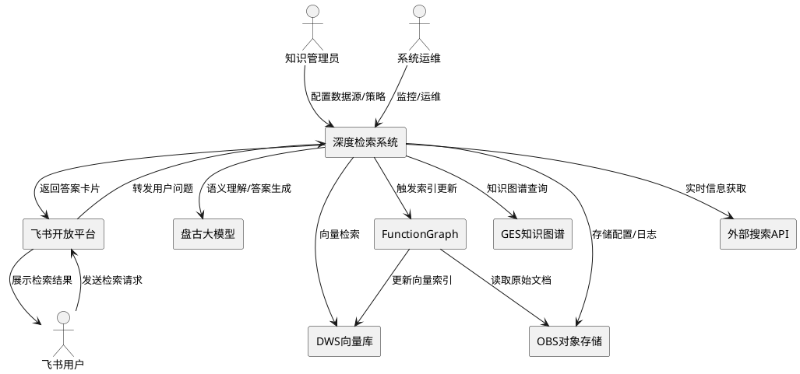
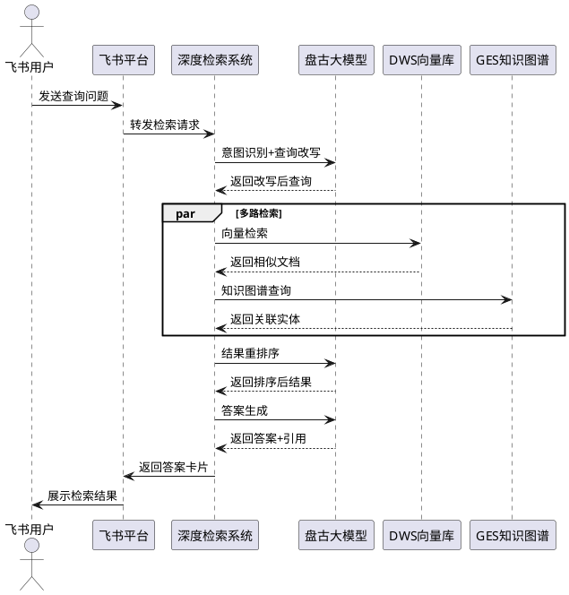
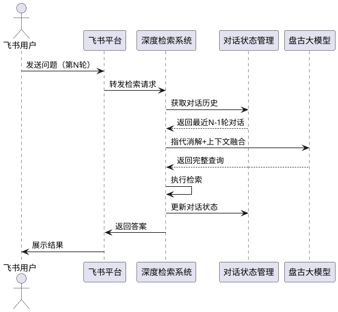
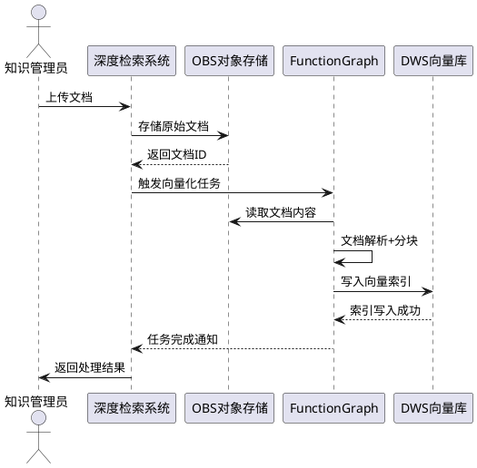
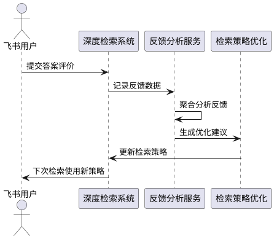

# **1. 组件定位**

## **1.1 核心职责**

本组件负责为华为云龙虾智能体提供深度检索能力，实现多源信息聚合、语义理解、智能推理和精准答案生成。

## **1.2 核心输入**

1. **用户检索请求**：来自飞书的自然语言查询问题
2. **上下文信息**：用户历史对话记录、用户画像、权限信息
3. **数据源配置**：向量数据库、知识图谱、外部API的连接配置
4. **增量数据**：实时更新的文档、知识库内容
5. **用户反馈**：对检索结果的评价、纠正建议

## **1.3 核心输出**

1. **检索答案**：包含答案内容、来源引用、置信度的结构化响应
2. **推荐问题**：基于当前检索结果的后续问题建议
3. **检索报告**：检索路径、耗时、数据源使用情况的统计信息
4. **飞书消息**：格式化的卡片消息，包含答案和交互元素
5. **审计日志**：检索行为、数据访问、结果质量的记录

## **1.4 职责边界**

本组件**不负责**以下事项：

1. **数据采集**：不负责从外部网站爬取数据，仅接收已采集的数据
2. **用户认证**：不负责飞书用户身份验证，由飞书平台完成
3. **数据存储**：不负责原始文档的持久化存储，由OBS/DWS负责
4. **模型训练**：不负责Embedding模型和LLM的训练，仅调用已训练模型
5. **权限管理**：不负责数据权限策略配置，仅执行权限检查

# **2. 领域术语**

**深度检索**
: 基于自然语言理解、多源信息融合、逻辑推理的智能检索过程，区别于传统的关键词匹配检索。
: 备注：包含语义检索、知识图谱推理、多轮迭代检索等能力。

**向量检索**
: 将文本转换为高维向量，通过计算向量相似度进行语义匹配的检索方式。
: 备注：使用Embedding模型将文本映射到向量空间。

**重排序**
: 对初步检索结果进行二次排序，提升结果相关性的过程。
: 备注：通常使用Cross-Encoder模型或LLM进行重排序。

**检索路径**
: Agent在执行检索任务时，自主规划的检索步骤序列。
: 备注：例如：向量检索 → 知识图谱查询 → 外部API调用 → 结果融合。

**溯源引用**
: 在生成的答案中标注信息来源，支持用户验证答案可信度。
: 备注：包含来源文档、段落位置、置信度分数。

**混合检索**
: 同时使用多种检索策略（向量、关键词、知识图谱）并融合结果的检索方式。

**增量索引**
: 对新增或修改的文档进行实时向量化更新，保持检索库时效性。

**检索增强生成（RAG）**
: Retrieval-Augmented Generation，先检索相关信息，再基于检索结果生成答案的技术范式。

# **3. 角色与边界**

## **3.1 核心角色**

1. **飞书用户**：通过飞书平台向龙虾智能体发起检索请求的终端用户
2. **知识管理员**：负责配置数据源、维护知识库、设置检索策略的管理人员
3. **系统运维**：负责监控检索系统性能、处理故障、优化配置的运维人员

## **3.2 外部系统**

1. **飞书开放平台**：接收用户消息、推送检索结果、管理用户会话
2. **华为云盘古大模型**：提供自然语言理解、答案生成、推理能力
3. **华为云DWS**：提供向量存储和检索能力
4. **华为云OBS**：存储原始文档、索引文件、配置数据
5. **华为云GES**：提供知识图谱存储和推理能力
6. **华为云FunctionGraph**：执行向量化、索引更新等异步任务
7. **外部搜索API**：当内部知识库不足时，调用外部搜索引擎获取实时信息

## **3.3 交互上下文**

# **4. DFX约束**

## **4.1 性能**

1. **检索响应时间**：简单查询（单数据源）必须在3秒内返回结果
   - 验收条件：用户发起简单查询 → 3秒内收到答案

2. **复杂检索响应时间**：复杂查询（多数据源融合）必须在10秒内返回结果
   - 验收条件：用户发起复杂查询 → 10秒内收到答案

3. **向量检索延迟**：单次向量检索必须在500ms内完成
   - 验收条件：系统执行向量检索 → 500ms内返回Top-K结果

4. **并发处理能力**：系统必须支持至少100 QPS的检索请求
   - 验收条件：100个并发检索请求 → 系统正常响应无超时

5. **索引更新延迟**：新增文档必须在5分钟内完成向量化并生效
   - 验收条件：管理员上传新文档 → 5分钟内可检索到新内容

## **4.2 可靠性**

1. **系统可用性**：检索服务必须达到99.9%的可用性
   - 验收条件：任意时间点 → 服务可正常访问

2. **故障恢复时间**：单点故障必须在30秒内自动恢复
   - 验收条件：某个服务实例故障 → 30秒内请求自动路由到健康实例

3. **数据一致性**：向量索引与原始文档必须保持最终一致性
   - 验收条件：文档更新 → 索引在5分钟内同步更新

4. **降级策略**：当外部依赖不可用时，系统必须降级服务而非完全失败
   - 验收条件：知识图谱服务故障 → 系统降级为纯向量检索模式

## **4.3 安全性**

1. **数据隔离**：不同租户的数据必须严格隔离，禁止跨租户访问
   - 验收条件：租户A发起检索 → 仅返回租户A的数据

2. **权限控制**：检索结果必须根据用户权限进行过滤
   - 验收条件：无权限用户检索敏感文档 → 结果中不包含敏感内容

3. **传输加密**：所有数据传输必须使用HTTPS加密
   - 验收条件：抓包检索请求 → 内容为加密密文

4. **审计日志**：所有检索操作必须记录审计日志，保留至少90天
   - 验收条件：用户发起检索 → 审计日志记录用户ID、查询内容、时间戳

5. **敏感信息过滤**：答案中必须自动过滤敏感信息（如身份证号、密码）
   - 验收条件：检索结果包含身份证号 → 自动脱敏显示

## **4.4 可维护性**

1. **监控指标**：必须接入以下监控指标
   - 检索请求QPS、响应时间P95/P99
   - 向量检索命中率、知识图谱查询次数
   - LLM调用次数、Token消耗量
   - 错误率、降级次数

2. **日志规范**：所有日志必须包含以下字段
   - TraceID（链路追踪）、UserID、QueryID、Timestamp
   - 日志级别、错误码、耗时统计

3. **链路追踪**：必须支持分布式链路追踪，完整记录检索路径
   - 验收条件：检索请求 → 可查看完整的调用链路和耗时分布

4. **告警规则**：必须配置以下告警
   - 错误率超过5% → 告警
   - P95响应时间超过5秒 → 告警
   - 向量检索失败率超过10% → 告警

## **4.5 兼容性**

1. **接口版本兼容**：API变更必须保持向后兼容，至少支持两个历史版本
   - 验收条件：使用旧版本API的客户端 → 仍可正常调用

2. **数据格式兼容**：向量维度变更时，必须支持新旧格式并存
   - 验收条件：升级Embedding模型 → 旧向量仍可检索

3. **飞书协议兼容**：必须兼容飞书开放平台的最新协议和两个历史版本
   - 验收条件：飞书协议升级 → 系统自动适配

# **5. 核心能力**

## **5.1 智能检索**

### **5.1.1 业务规则**

1. **意图识别**：系统必须准确识别用户查询意图（事实查询、操作指引、对比分析等）
   - 验收条件：用户输入"如何配置VPN" → 系统识别为"操作指引"意图

2. **查询改写**：系统必须对用户查询进行语义改写，提升检索效果
   - 验收条件：用户输入"怎么连不上网" → 改写为"网络连接故障排查方法"

3. **多路检索**：系统必须并行执行向量检索、关键词检索、知识图谱查询
   - 验收条件：用户发起查询 → 同时触发三种检索策略

4. **结果融合**：系统必须使用重排序模型对多路检索结果进行融合排序
   - 验收条件：多路检索返回结果 → 重排序后返回Top-K结果

5. **答案生成**：系统必须基于检索结果和用户问题生成自然语言答案
   - 验收条件：检索到相关文档 → 生成包含答案和引用的完整响应

6. **溯源标注**：答案中必须标注信息来源，支持用户点击查看原文
   - 验收条件：答案包含引用 → 用户可点击跳转到原文位置

7. **置信度评估**：系统必须评估答案的可信度，低置信度答案需提示用户
   - 验收条件：检索结果不足 → 提示"答案可能不准确，建议人工确认"

8. **禁止项**：禁止在无任何检索结果时编造答案
   - 验收条件：检索结果为空 → 明确告知用户"未找到相关信息"

### **5.1.2 交互流程**

### **5.1.3 异常场景**

1. **向量检索超时**
   - 触发条件：DWS响应时间超过500ms
   - 系统行为：降级为关键词检索，记录超时日志
   - 用户感知：正常返回结果，但可能相关性降低

2. **LLM调用失败**
   - 触发条件：盘古大模型API调用失败或超时
   - 系统行为：使用缓存的相似问题答案，或返回原始检索结果
   - 用户感知：提示"答案生成服务暂时不可用，返回原始检索结果"

3. **知识图谱服务不可用**
   - 触发条件：GES服务故障或响应超时
   - 系统行为：跳过知识图谱查询，仅使用向量检索
   - 用户感知：正常返回结果，但缺少关联推理信息

4. **检索结果为空**
   - 触发条件：所有检索策略均未返回结果
   - 系统行为：调用外部搜索API或返回推荐问题
   - 用户感知：提示"未在知识库中找到相关信息，建议：1.尝试其他关键词 2.查看推荐问题"

5. **用户输入非法内容**
   - 触发条件：用户输入包含SQL注入、XSS攻击等恶意内容
   - 系统行为：拒绝执行检索，记录安全审计日志
   - 用户感知：提示"输入内容不合法，请重新输入"

## **5.2 多轮对话检索**

### **5.2.1 业务规则**

1. **上下文理解**：系统必须理解用户当前问题与历史对话的关联
   - 验收条件：用户先问"华为云ECS"，再问"怎么创建" → 理解为"如何创建华为云ECS"

2. **指代消解**：系统必须解析用户问题中的代词指代
   - 验收条件：用户问"它的价格是多少" → 解析"它"指向前文提到的产品

3. **对话状态管理**：系统必须维护对话状态，支持追问、澄清、切换话题
   - 验收条件：用户追问"还有其他方法吗" → 基于前文答案提供补充信息

4. **对话历史限制**：系统最多保留最近10轮对话历史，避免上下文过长
   - 验收条件：用户进行第11轮对话 → 仅使用最近10轮历史

5. **禁止项**：禁止在用户明确切换话题后继续使用旧话题上下文
   - 验收条件：用户说"换个话题，问个新问题" → 清空历史上下文

### **5.2.2 交互流程**

### **5.2.3 异常场景**

1. **对话历史丢失**
   - 触发条件：会话超时或服务重启导致对话历史丢失
   - 系统行为：提示用户重新描述问题
   - 用户感知：提示"对话已过期，请重新描述您的问题"

2. **指代消解失败**
   - 触发条件：无法确定代词指代对象
   - 系统行为：追问用户澄清
   - 用户感知：提示"您说的'它'是指什么？请明确一下"

## **5.3 知识库管理**

### **5.3.1 业务规则**

1. **文档上传**：管理员必须能够上传文档（PDF、Word、Markdown、HTML等格式）
   - 验收条件：管理员上传PDF文档 → 系统解析并存储

2. **自动向量化**：系统必须自动对上传的文档进行分块和向量化
   - 验收条件：文档上传成功 → 5分钟内完成向量化并生效

3. **增量更新**：系统必须支持文档的增量更新，无需重建全量索引
   - 验收条件：修改某个文档 → 仅更新该文档的向量

4. **文档删除**：删除文档时，系统必须同步删除对应的向量索引
   - 验收条件：删除文档 → 检索不再返回该文档内容

5. **数据源配置**：管理员必须能够配置多个数据源（OBS桶、数据库、外部API）
   - 验收条件：配置OBS数据源 → 自动同步桶内文档

6. **权限设置**：管理员必须能够设置文档的访问权限（公开、部门级、用户级）
   - 验收条件：设置文档为部门级权限 → 仅该部门用户可检索

7. **禁止项**：禁止上传包含恶意代码的文档
   - 验收条件：上传包含脚本的HTML → 拒绝并提示安全风险

### **5.3.2 交互流程**

### **5.3.3 异常场景**

1. **文档解析失败**
   - 触发条件：上传损坏的PDF或非标准格式文档
   - 系统行为：记录错误日志，通知管理员
   - 用户感知：提示"文档解析失败，请检查文件格式"

2. **向量化任务超时**
   - 触发条件：文档过大或Embedding服务繁忙
   - 系统行为：自动重试，超过3次后通知管理员
   - 用户感知：提示"文档处理中，预计5分钟后生效"

3. **存储空间不足**
   - 触发条件：OBS或DWS存储空间已满
   - 系统行为：拒绝上传，通知管理员扩容
   - 用户感知：提示"存储空间不足，请联系管理员"

## **5.4 检索效果优化**

### **5.4.1 业务规则**

1. **用户反馈收集**：系统必须收集用户对答案的评价（有用/无用、纠正建议）
   - 验收条件：用户点击"答案无用" → 记录反馈信息

2. **反馈学习**：系统必须基于用户反馈优化检索排序策略
   - 验收条件：多个用户反馈某答案无用 → 降低该答案排序权重

3. **A/B测试**：系统必须支持检索策略的A/B测试，对比效果差异
   - 验收条件：配置A/B测试 → 对比两组用户的满意度

4. **检索日志分析**：系统必须定期分析检索日志，识别高频问题、零结果查询
   - 验收条件：每周生成检索效果报告 → 包含高频问题Top100

5. **禁止项**：禁止使用用户隐私数据进行检索优化
   - 验收条件：优化模型 → 仅使用脱敏后的查询日志

### **5.4.2 交互流程**

### **5.4.3 异常场景**

1. **反馈数据异常**
   - 触发条件：短时间内大量负面反馈（可能恶意攻击）
   - 系统行为：忽略异常反馈，记录安全日志
   - 用户感知：无感知

2. **策略优化失败**
   - 触发条件：新策略导致检索效果下降
   - 系统行为：自动回滚到旧策略
   - 用户感知：无感知，系统自动恢复

# **6. 数据约束**

## **6.1 检索请求**

1. **query**：用户的自然语言查询，长度不超过1000字符，必填
2. **user_id**：用户唯一标识，字符串，必填
3. **session_id**：会话唯一标识，字符串，必填
4. **context**：对话历史，数组，最多包含10轮对话，可选
5. **filters**：检索过滤条件（如时间范围、数据源），对象，可选
6. **top_k**：返回结果数量，整数，范围1-20，默认5

## **6.2 检索结果**

1. **answer**：生成的自然语言答案，长度不超过5000字符，必填
2. **sources**：信息来源列表，数组，每个元素包含文档ID、段落、置信度，必填
3. **confidence**：答案置信度，浮点数，范围0-1，必填
4. **related_questions**：推荐问题列表，数组，最多5个，可选
5. **search_path**：检索路径记录，数组，包含每个步骤的耗时和结果数，可选
6. **timestamp**：检索时间戳，ISO 8601格式，必填

## **6.3 文档对象**

1. **doc_id**：文档唯一标识，字符串，必填
2. **title**：文档标题，长度不超过200字符，必填
3. **content**：文档内容，长度不超过1MB，必填
4. **format**：文档格式（PDF、Word、Markdown等），枚举值，必填
5. **source**：数据来源（OBS、数据库、外部API），字符串，必填
6. **permission**：访问权限（public、department、private），枚举值，必填
7. **created_at**：创建时间，ISO 8601格式，必填
8. **updated_at**：更新时间，ISO 8601格式，必填
9. **vector_status**：向量化状态（pending、completed、failed），枚举值，必填

## **6.4 用户反馈**

1. **feedback_id**：反馈唯一标识，字符串，必填
2. **query_id**：对应的检索请求ID，字符串，必填
3. **user_id**：用户ID，字符串，必填
4. **rating**：评价（useful、useless），枚举值，必填
5. **comment**：用户补充说明，长度不超过500字符，可选
6. **timestamp**：反馈时间，ISO 8601格式，必填

## **6.5 对话历史**

1. **session_id**：会话唯一标识，字符串，必填
2. **user_id**：用户ID，字符串，必填
3. **messages**：对话消息列表，数组，每个元素包含角色（user/assistant）、内容、时间戳，必填
4. **created_at**：会话创建时间，ISO 8601格式，必填
5. **updated_at**：会话更新时间，ISO 8601格式，必填
6. **status**：会话状态（active、expired），枚举值，必填
