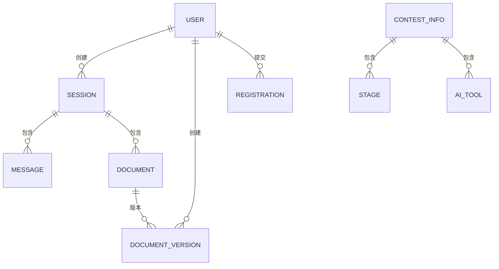

# AI 创意大赛网站 - 系统架构文档

> 文档版本：1.0.0
> 生成时间：2026-03-21
> 系统版本：v2.0

---

## 一、系统概述

### 1.1 项目简介

AI 创意大赛网站是一个面向企业内部的 AI 应用创意竞赛平台，提供大赛信息展示、培训资料学习、创意工坊（需求收敛）等核心功能。系统采用前后端分离架构，支持用户注册登录、大赛报名、需求澄清、文档管理等功能。

### 1.2 系统特性

| 特性 | 说明 |
|------|------|
| 多角色支持 | 普通用户、管理员两种角色 |
| 创意工坊 | 基于 AI 的需求收敛助手，支持 5W2H 分析 |
| 培训管理 | 视频培训资料管理 |
| 大赛报名 | 在线报名参赛 |
| 文档同步 | 支持飞书文档同步 |

---

## 二、技术架构

### 2.1 技术栈概览

```
┌─────────────────────────────────────────────────────────────────┐
│                          前端层                                  │
│  Vue 3 + Vite + Element Plus + Pinia + Vue Router + Axios      │
└─────────────────────────────────────────────────────────────────┘
                                │
                                ▼ HTTP/HTTPS
┌─────────────────────────────────────────────────────────────────┐
│                          后端层                                  │
│  Node.js + Express + Sequelize ORM + JWT + Multer               │
└─────────────────────────────────────────────────────────────────┘
                                │
                    ┌───────────┴───────────┐
                    ▼                       ▼
           ┌──────────────┐        ┌──────────────┐
           │   MySQL      │        │  文件系统    │
           │   数据库      │        │  静态资源    │
           └──────────────┘        └──────────────┘
                                │
                                ▼
           ┌──────────────────────────────────────┐
           │           AI 服务层                   │
           │  需求收敛技能 + 意图识别 + 智能洞察    │
           └──────────────────────────────────────┘
```

### 2.2 前端技术栈

| 技术 | 版本 | 用途 |
|------|------|------|
| Vue | 3.5.25 | 前端框架 |
| Vite | 7.3.1 | 构建工具 |
| Element Plus | 2.13.3 | UI 组件库 |
| Pinia | 3.0.4 | 状态管理 |
| Vue Router | 4.6.4 | 路由管理 |
| Axios | 1.6.7 | HTTP 客户端 |
| markdown-it | 14.1.1 | Markdown 渲染 |
| highlight.js | 11.11.1 | 代码高亮 |
| xlsx | 0.18.5 | Excel 处理 |

### 2.3 后端技术栈

| 技术 | 版本 | 用途 |
|------|------|------|
| Node.js | LTS | 运行时 |
| Express | 4.18.2 | Web 框架 |
| Sequelize | 6.37.1 | ORM |
| MySQL2 | 3.9.1 | 数据库驱动 |
| jsonwebtoken | 9.0.2 | JWT 认证 |
| bcryptjs | 2.4.3 | 密码加密 |
| cors | 2.8.5 | 跨域处理 |
| multer | 1.4.5-lts.1 | 文件上传 |
| js-yaml | 4.1.1 | YAML 解析 |

---

## 三、系统架构图

### 3.1 分层架构

```
┌─────────────────────────────────────────────────────────────────────────┐
│                           客户端层 (Client)                              │
│  ┌─────────────────────────────────────────────────────────────────┐   │
│  │  Vue 3 SPA                                                          │   │
│  │   ├── views/          页面视图 (Home, Training, Registration 等)    │   │
│  │   ├── components/     通用组件 (Header, Footer, Modal)              │   │
│  │   ├── router/         路由配置 + 导航守卫                           │   │
│  │   ├── stores/         Pinia 状态管理 (user store)                  │   │
│  │   └── api/            API 请求封装                                  │   │
│  └─────────────────────────────────────────────────────────────────┘   │
└─────────────────────────────────────────────────────────────────────────┘
                                    │
                                    ▼
┌─────────────────────────────────────────────────────────────────────────┐
│                           网关层 (Gateway)                              │
│  ┌─────────────────────────────────────────────────────────────────┐   │
│  │  Nginx 反向代理                                                      │   │
│  │   ├── /ai-contest/api  →  后端服务 :3000                          │   │
│  │   ├── /ai-contest      →  前端静态资源                             │   │
│  │   └── /ai-contest/uploads → 文件上传服务                           │   │
│  └─────────────────────────────────────────────────────────────────┘   │
└─────────────────────────────────────────────────────────────────────────┘
                                    │
                                    ▼
┌─────────────────────────────────────────────────────────────────────────┐
│                           应用层 (Application)                          │
│  ┌─────────────────────────────────────────────────────────────────┐   │
│  │  Express.js 服务器                                                  │   │
│  │  ┌─────────────────────────────────────────────────────────────┐  │   │
│  │  │  中间件层 (Middleware)                                        │  │   │
│  │  │   ├── cors           跨域处理                                 │  │   │
│  │  │   ├── express.json   JSON 解析                               │  │   │
│  │  │   ├── express.urlencoded URL 编码解析                        │  │   │
│  │  │   └── auth.js        JWT 认证中间件                          │  │   │
│  │  └─────────────────────────────────────────────────────────────┘  │   │
│  │  ┌─────────────────────────────────────────────────────────────┐  │   │
│  │  │  路由层 (Routes)                                            │  │   │
│  │  │   ├── /api/auth          认证路由 (登录/注册/登出)          │  │   │
│  │  │   ├── /api/user          用户路由 (个人信息)                 │  │   │
│  │  │   ├── /api/trainings     培训路由 (CRUD)                    │  │   │
│  │  │   ├── /api/contest       大赛信息路由                       │  │   │
│  │  │   ├── /api/registrations 报名路由                           │  │   │
│  │  │   ├── /api/sessions      会话路由                           │  │   │
│  │  │   ├── /api/requirement   需求收敛路由                       │  │   │
│  │  │   ├── /api/admin         管理员路由                         │  │   │
│  │  │   ├── /api/upload        文件上传路由                       │  │   │
│  │  │   └── /api/v2            V2 API 路由                       │  │   │
│  │  └─────────────────────────────────────────────────────────────┘  │   │
│  └─────────────────────────────────────────────────────────────────┘   │
└─────────────────────────────────────────────────────────────────────────┘
                                    │
                                    ▼
┌─────────────────────────────────────────────────────────────────────────┐
│                           服务层 (Services)                            │
│  ┌─────────────────────────────────────────────────────────────────┐   │
│  │  核心服务 (core/)                                                 │   │
│  │   ├── AgentService.js     Agent 配置与管理                       │   │
│  │   ├── SessionService.js   会话管理 (JSONL 持久化)                 │   │
│  │   ├── SkillService.js     技能服务                               │   │
│  │   ├── ArtifactService.js  工件服务                               │   │
│  │   ├── RouterService.js    路由服务                               │   │
│  │   ├── UserService.js      用户服务                               │   │
│  │   ├── ConfigService.js    配置服务                               │   │
│  │   └── PromptBuilder.js    Prompt 构建器                          │   │
│  └─────────────────────────────────────────────────────────────────┘   │
│  ┌─────────────────────────────────────────────────────────────────┐   │
│  │  需求收敛模块 (requirement-convergence/)                         │   │
│  │   ├── src/ai-enhancement/      AI 增强模块                       │   │
│  │   ├── src/insight-engine/      智能洞察引擎                      │   │
│  │   ├── src/knowledge-graph/     知识图谱                          │   │
│  │   ├── src/validation-engine/   验证引擎                          │   │
│  │   ├── src/template-library/    模板库                            │   │
│  │   ├── src/persona-engine/      人格化引擎                        │   │
│  │   └── bridge.js                桥接层                            │   │
│  └─────────────────────────────────────────────────────────────────┘   │
└─────────────────────────────────────────────────────────────────────────┘
                                    │
                                    ▼
┌─────────────────────────────────────────────────────────────────────────┐
│                           数据层 (Data)                                 │
│  ┌─────────────────────────────────────────────────────────────────┐   │
│  │  MySQL 数据库 (utf8mb4_unicode_ci)                               │   │
│  │   ├── users             用户表                                  │   │
│  │   ├── sessions          会话表                                  │   │
│  │   ├── messages          消息表                                  │   │
│  │   ├── documents         文档表                                  │   │
│  │   ├── document_versions 文档版本表                             │   │
│  │   ├── trainings         培训表                                  │   │
│  │   ├── registrations     报名表                                  │   │
│  │   ├── contest_info      大赛信息表                             │   │
│  │   ├── stages            阶段表                                 │   │
│  │   └── ai_tools          AI 工具表                              │   │
│  └─────────────────────────────────────────────────────────────────┘   │
│  ┌─────────────────────────────────────────────────────────────────┐   │
│  │  文件系统                                                        │   │
│  │   ├── agents/{agentId}/sessions/  会话 JSONL 文件               │   │
│  │   ├── artifacts/{sessionId}/     会话产物                      │   │
│  │   ├── uploads/                   上传文件                       │   │
│  │   └── config/agents/             Agent YAML 配置               │   │
│  └─────────────────────────────────────────────────────────────────┘   │
└─────────────────────────────────────────────────────────────────────────┘
```

---

## 四、数据库架构

### 4.1 ER 关系图



### 4.2 数据表结构

#### users 用户表

| 字段 | 类型 | 说明 |
|------|------|------|
| id | UUID | 主键 |
| username | VARCHAR(50) | 用户名，唯一 |
| email | VARCHAR(100) | 邮箱，唯一 |
| password_hash | VARCHAR(255) | 密码哈希 (bcrypt) |
| avatar_url | VARCHAR(255) | 头像 URL |
| last_login_at | DATETIME | 最后登录时间 |
| role | ENUM('user','admin') | 角色 |
| is_active | BOOLEAN | 是否激活 |
| created_at | DATETIME | 创建时间 |
| updated_at | DATETIME | 更新时间 |

#### sessions 会话表

| 字段 | 类型 | 说明 |
|------|------|------|
| id | UUID | 主键 |
| user_id | UUID | 外键，用户 ID |
| title | VARCHAR(200) | 会话标题 |
| status | ENUM('active','archived','deleted') | 状态 |
| last_message_at | DATETIME | 最后消息时间 |
| metadata | JSON | 元数据 |
| created_at | DATETIME | 创建时间 |
| updated_at | DATETIME | 更新时间 |

#### messages 消息表

| 字段 | 类型 | 说明 |
|------|------|------|
| id | UUID | 主键 |
| session_id | UUID | 外键，会话 ID |
| role | ENUM('user','assistant') | 角色 |
| content | TEXT | 消息内容 |
| metadata | JSON | 元数据 |
| created_at | DATETIME | 创建时间 |

#### documents 文档表

| 字段 | 类型 | 说明 |
|------|------|------|
| id | UUID | 主键 |
| session_id | UUID | 外键，会话 ID |
| title | VARCHAR(200) | 文档标题 |
| type | VARCHAR(50) | 文档类型 |
| status | VARCHAR(50) | 状态 |
| created_at | DATETIME | 创建时间 |
| updated_at | DATETIME | 更新时间 |

#### document_versions 文档版本表

| 字段 | 类型 | 说明 |
|------|------|------|
| id | UUID | 主键 |
| document_id | UUID | 外键，文档 ID |
| created_by | UUID | 外键，创建者 ID |
| version | INT | 版本号 |
| content | TEXT | 文档内容 |
| metadata | JSON | 元数据 |
| created_at | DATETIME | 创建时间 |

#### trainings 培训表

| 字段 | 类型 | 说明 |
|------|------|------|
| id | INT | 主键，自增 |
| name | VARCHAR(100) | 培训名称 |
| video_url | TEXT | 视频地址 |
| cover_image | TEXT | 封面图片 |
| created_at | DATETIME | 创建时间 |
| updated_at | DATETIME | 更新时间 |

#### registrations 报名表

| 字段 | 类型 | 说明 |
|------|------|------|
| id | UUID | 主键 |
| user_id | UUID | 外键，用户 ID |
| name | VARCHAR(50) | 姓名 |
| department | VARCHAR(100) | 部门 |
| contact | VARCHAR(50) | 联系方式 |
| creative_direction | TEXT | 创意方向 |
| status | ENUM('pending','approved','rejected') | 状态 |
| created_at | DATETIME | 创建时间 |
| updated_at | DATETIME | 更新时间 |

#### contest_info 大赛信息表

| 字段 | 类型 | 说明 |
|------|------|------|
| id | INT | 主键，自增 |
| title | VARCHAR(200) | 标题 |
| subtitle | VARCHAR(200) | 副标题 |
| badge_text | VARCHAR(50) | 标签文字 |
| poster_url | VARCHAR(255) | 海报 URL |
| info_cards | JSON | 信息卡片 |
| stages | JSON | 比赛阶段 |
| ai_tools | JSON | AI 工具列表 |
| created_at | DATETIME | 创建时间 |
| updated_at | DATETIME | 更新时间 |

#### stages 阶段表

| 字段 | 类型 | 说明 |
|------|------|------|
| id | INT | 主键，自增 |
| contest_info_id | INT | 外键，大赛 ID |
| name | VARCHAR(100) | 阶段名称 |
| description | TEXT | 描述 |
| time | VARCHAR(100) | 时间 |
| order | INT | 排序 |

#### ai_tools AI 工具表

| 字段 | 类型 | 说明 |
|------|------|------|
| id | INT | 主键，自增 |
| contest_info_id | INT | 外键，大赛 ID |
| category | VARCHAR(50) | 分类 |
| name | VARCHAR(100) | 工具名称 |
| url | VARCHAR(255) | 工具 URL |
| description | TEXT | 描述 |
| rank | INT | 排序 |
| recommend | VARCHAR(50) | 推荐级别 |

---

## 五、前端架构

### 5.1 路由结构

| 路径 | 组件 | 说明 | 权限 |
|------|------|------|------|
| / | Home.vue | 首页 | 公开 |
| /training | Training.vue | 培训页 | 公开 |
| /registration | Registration.vue | 报名页 | 公开 |
| /user/login | Login.vue | 登录页 | 公开 |
| /user/register | Register.vue | 注册页 | 公开 |
| /requirement | Layout.vue | 创意工坊 | 需登录 |
| /requirement/sessions | SessionList.vue | 会话列表 | 需登录 |
| /requirement/session/:id | ChatWindow.vue | 聊天窗口 | 需登录 |
| /requirement/documents | DocumentList.vue | 文档管理 | 需登录 |
| /training-admin | TrainingAdmin.vue | 培训管理 | 仅管理员 |

### 5.2 状态管理

**user store (Pinia)**

```javascript
{
  state: {
    token: string,           // JWT Token
    userInfo: {             // 用户信息
      id: string,
      username: string,
      email: string,
      role: 'user' | 'admin'
    }
  },
  actions: {
    login(username, password),
    register(username, email, password),
    logout(),
    fetchProfile()
  }
}
```

### 5.3 组件树

```
App.vue
├── Header.vue
│   ├── Logo
│   ├── Navigation Menu
│   └── User Menu (登录/注册/用户信息)
├── Router View
│   ├── Home.vue
│   ├── Training.vue
│   ├── Registration.vue
│   ├── user/Login.vue
│   ├── user/Register.vue
│   ├── requirement/Layout.vue
│   │   ├── SessionList.vue
│   │   ├── ChatWindow.vue
│   │   └── DocumentList.vue
│   └── TrainingAdmin.vue
└── Footer.vue
```

---

## 六、API 架构

### 6.1 路由总览

```
/api
├── /auth
│   ├── POST /login          登录
│   ├── POST /register       注册
│   └── POST /logout         登出
├── /user
│   ├── GET /profile         获取用户信息
│   ├── PUT /profile         更新用户信息
│   └── PUT /password        修改密码
├── /trainings
│   ├── GET /                获取培训列表
│   ├── POST /               创建培训 (管理员)
│   ├── GET /:id             获取培训详情
│   ├── PUT /:id             更新培训 (管理员)
│   └── DELETE /:id           删除培训 (管理员)
├── /contest
│   ├── GET /info            获取大赛信息
│   └── PUT /info            更新大赛信息 (管理员)
├── /registrations
│   ├── GET /                获取报名列表 (管理员)
│   ├── POST /               创建报名
│   ├── GET /:id             获取报名详情
│   └── PUT /:id/status      更新报名状态 (管理员)
├── /sessions
│   ├── GET /                获取会话列表
│   ├── POST /               创建会话
│   ├── GET /:id             获取会话详情
│   ├── DELETE /:id           删除会话
│   └── GET /:id/messages    获取会话消息
├── /requirement
│   ├── POST /analyze        需求分析
│   ├── POST /validate       需求验证
│   ├── POST /graph          需求图谱
│   ├── POST /recommend      智能推荐
│   └── GET /health          健康检查
├── /admin
│   ├── GET /users           获取用户列表
│   ├── GET /logs            获取系统日志
│   └── GET /stats           获取统计数据
├── /upload
│   └── POST /               文件上传
└── /v2
    └── (V2 API 路由)
```

---

## 七、核心服务详解

### 7.1 SessionService

**职责**：管理 AI 会话生命周期

**核心功能**：
- 创建/删除会话
- 消息持久化 (JSONL 文件)
- 会话历史加载
- 存储结构：`agents/{agentId}/sessions/{sessionId}.jsonl`

### 7.2 AgentService

**职责**：管理 Agent 配置

**核心功能**：
- 加载 Agent YAML 配置 (capability.yaml, soul.yaml, skills.yaml)
- 获取/设置用户绑定的 Agent
- 维护 Agent 能力配置

### 7.3 ConfigService

**职责**：系统配置管理

**核心功能**：
- 加载 system.yaml 配置
- 管理 AI Provider 配置
- 管理默认 Agent

### 7.4 SkillService

**职责**：技能服务调度

**核心功能**：
- 意图识别 (QA/REQUIREMENT/CHAT)
- 5W2H 分析
- 风险预警
- 依赖发现

### 7.5 需求收敛模块

```
requirement-convergence/
├── src/
│   ├── ai-enhancement/      AI 增强
│   ├── insight-engine/       智能洞察 (5W2H评分、风险、依赖)
│   ├── knowledge-graph/     知识图谱 (关系、影响、版本)
│   ├── validation-engine/   验证引擎 (可测试性、验收标准)
│   ├── template-library/    模板库 (行业模板、合规)
│   └── persona-engine/      人格化引擎 (角色切换、记忆)
├── bridge.js                桥接层
└── index.js                 入口
```

---

## 八、部署架构

### 8.1 Nginx 配置

```nginx
upstream backend {
    server 127.0.0.1:3000;
}

server {
    listen 80;
    server_name _;
    client_max_body_size 20M;

    location /ai-contest/api {
        proxy_pass http://backend;
        proxy_http_version 1.1;
        proxy_set_header Host $host;
        proxy_set_header X-Real-IP $remote_addr;
    }

    location /ai-contest/uploads {
        proxy_pass http://backend;
    }

    location /ai-contest {
        alias /var/www/ai-contest/frontend/dist;
        try_files $uri $uri/ /ai-contest/index.html;
    }
}
```

### 8.2 环境变量

**后端 (.env)**
```
PORT=3000
NODE_ENV=development
DB_HOST=localhost
DB_PORT=3306
DB_NAME=ai_contest
DB_USER=root
DB_PASSWORD=
JWT_SECRET=your-secret-key
CORS_ORIGIN=*
```

**前端**
```
VITE_API_BASE_URL=/ai-contest/api
```

---

## 九、安全设计

### 9.1 认证授权

| 机制 | 说明 |
|------|------|
| JWT | HS256 算法，7 天有效期 |
| 密码加密 | bcrypt，10 轮 salt |
| 路由守卫 | 登录状态 + 角色检查 |
| CORS | 可配置来源 |

### 9.2 权限矩阵

| 资源 | 匿名 | 普通用户 | 管理员 |
|------|------|----------|--------|
| 首页/培训/报名 | ✅ | ✅ | ✅ |
| 登录/注册 | ✅ | ✅ | ✅ |
| 创意工坊 | ❌ | ✅ | ✅ |
| 培训管理 | ❌ | ❌ | ✅ |
| 用户列表 | ❌ | ❌ | ✅ |

---

## 十、目录结构

```
ai-contest-web/
├── server/
│   ├── app.js                    # Express 入口
│   ├── config/
│   │   ├── database.js            # Sequelize 配置
│   │   ├── providers.yaml         # AI Provider 配置
│   │   ├── skill.js               # 技能配置
│   │   └── system.yaml            # 系统配置
│   ├── models/                    # 数据模型
│   │   ├── index.js
│   │   ├── User.js
│   │   ├── Session.js
│   │   ├── Message.js
│   │   ├── Document.js
│   │   ├── DocumentVersion.js
│   │   ├── Training.js
│   │   ├── Registration.js
│   │   ├── ContestInfo.js
│   │   ├── Stage.js
│   │   ├── AiTool.js
│   │   └── Admin.js
│   ├── routes/                    # 路由
│   │   ├── index.js
│   │   ├── auth.js
│   │   ├── user.js
│   │   ├── training.js
│   │   ├── registration.js
│   │   ├── contest.js
│   │   ├── session.js
│   │   ├── requirement.js
│   │   ├── admin.js
│   │   ├── upload.js
│   │   └── v2.js
│   ├── middleware/               # 中间件
│   │   ├── auth.js
│   │   └── userAuth.js
│   ├── services/                 # 服务层
│   │   ├── core/                 # 核心服务
│   │   │   ├── AgentService.js
│   │   │   ├── SessionService.js
│   │   │   ├── SkillService.js
│   │   │   ├── ArtifactService.js
│   │   │   ├── RouterService.js
│   │   │   ├── UserService.js
│   │   │   ├── ConfigService.js
│   │   │   └── PromptBuilder.js
│   │   ├── requirement-convergence/  # 需求收敛
│   │   │   ├── src/
│   │   │   └── bridge.js
│   │   ├── enhancedSkillService.js
│   │   ├── skillService.js
│   │   └── intentRecognizer.js
│   ├── skills/                   # 技能定义
│   │   └── requirement-convergence/
│   ├── agents/                   # Agent 数据
│   │   └── default-agent/
│   │       └── sessions/
│   ├── artifacts/                # 会话产物
│   ├── uploads/                  # 上传文件
│   ├── database/                 # SQL 脚本
│   └── scripts/                  # 工具脚本
├── src/                          # 前端源码
│   ├── main.js
│   ├── App.vue
│   ├── api/                     # API 封装
│   ├── components/               # 组件
│   ├── router/                  # 路由
│   ├── stores/                  # 状态
│   ├── views/                   # 页面
│   │   ├── Home.vue
│   │   ├── Training.vue
│   │   ├── TrainingAdmin.vue
│   │   ├── Registration.vue
│   │   ├── user/
│   │   │   ├── Login.vue
│   │   │   └── Register.vue
│   │   └── requirement/
│   │       ├── Layout.vue
│   │       ├── SessionList.vue
│   │       ├── ChatWindow.vue
│   │       └── DocumentList.vue
│   └── assets/
├── public/
├── nginx/
├── package.json
└── vite.config.js
```

---

## 附录

### A. 相关文档

- [需求文档目录](../需求/)
- [系统设计 DSL](../需求/system_design.dsl)
- [API 信息](../需求/API信息.md)
- [项目背景](../需求/1.AI大赛项目背景.md)

### B. 版本记录

| 版本 | 日期 | 说明 |
|------|------|------|
| 1.0.0 | 2026-03-21 | 初始架构文档 |

---

*文档结束*
